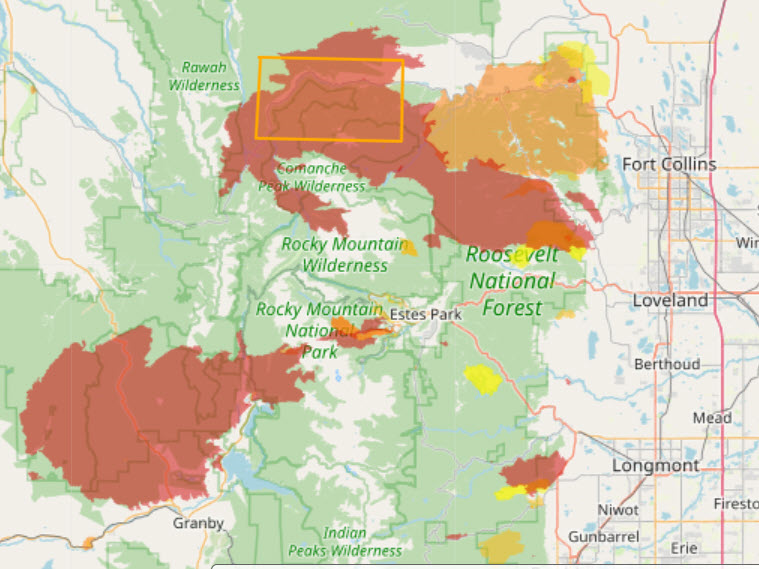
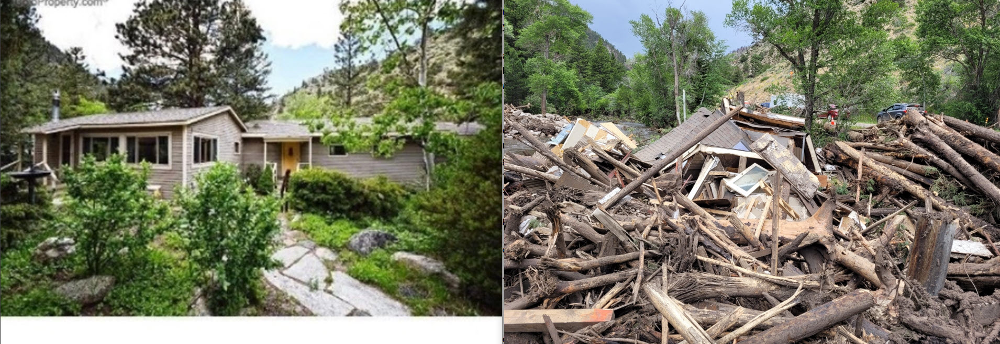
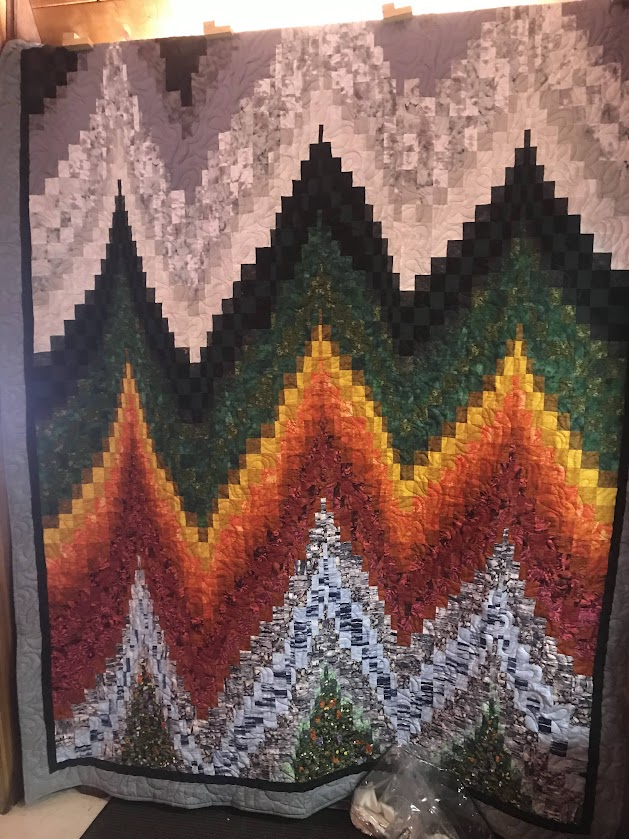

---
output:
  bookdown::pdf_book:
    toc : no
    keep_tex: no
    number_sections: yes
link-citations: true
linkReferences: true
bibliography: ./References/introduction.bib
---

<!-- This section is mandatory! -->

High severity wildfire and post-fire flooding can dramatically alter landscapes and disrupt people's lives, sometimes in complex ways not readily visible to the broader public or to the naked eye. Wildfires in the western U.S., and elsewhere in the world, are becoming more destructive for communities and ecological systems [@wassermanClimateInfluencesFuture2023; @turnerMagnitudeDirectionTempo2022]. The associated hazards of wildfire smoke, extreme heat, and post-fire flooding have increasingly dire consequences for people and the environments in which they live and on which they rely for access to clean air, water, and the values they derive from the natural world [@jackaFloodFireReorganizing2023; @wilmotExpandingNumberWestern2021]. In response to the changes in how wildfires are affecting our communities and environments over roughly the last two decades, this research explores how people are reorienting to transformed lives and landscapes and coping with loss as a result of wildfire. This dissertation contributes to a more than human anthropology [@tsingMorethanHumanSocialityCall2013] by attending to the qualities of fire and flood as they exist in a processual and relational material world [@ingoldBeingAliveEssays2011] through sustained ethnographic engagement with people and place.

Situating my research in a wildfire-impacted landscape and my research questions in landscape as a theoretical concept, I ask: how do people understand their own lives and experiences within the different timescales and lifecycles of human and more than human ecologies in the formation of wildfire? What capacity do we have &mdash; as individuals, communities, and governments &mdash; to make sense of affective and ecological transformations wrought by wildfire and post-fire flooding? How do institutional and policy responses to wildfires shape people’s relations with different forms of governance and the environment? How do such responses affect the capacity of people to make decisions about their lives and futures?

I explore these questions through an anthropological exploration of the post-fire, unfurling material configurations in the landscapes of the rural, unincorporated upper Cache la Poudre Canyon (hereafter Poudre Canyon or Poudre). This mountainous community in northern Colorado was one among sixteen in Larimer County impacted by the 2020 Cameron Peak Fire (CPF) and subsequent catastrophic post-fire flooding and debris flows. My own family's historic home was destroyed in this wildfire, an experience which formed the basis for this dissertation. My research engages three groups of people in relation to the CPF: community members (primarily residing in the upper Poudre, with a handful living in the periphery); scientists who study different aspects of fire, most with study sites in the Poudre; and fire/emergency/watershed practitioners and managers. These are not discrete groups, as some people are both community members and practitioners or scientists. Through an ethnographic inquiry into how people make sense of rapid, large-scale landscape changes, my research contributes to an understanding of our relationship with social-ecological disruptions and uncertainty and how these (re)shape senses of belonging [@adamsAnticipationTechnoscienceLife2009; @nealeKnowingWildfireRisk2016].


```{r figureTitle1, eval=True, echo=T, fig.width = 3, fig.height = 2, echo=FALSE, fig.cap="Cameron Peak and other fire perimeters with the Upper Poudre outlined in orange rectangle. Image from CalTopo.", fig.scap = "CPF Perimeter", out.extra=''}

# Call the image

```

I make three main arguments in this dissertation rooted in my research findings and outlined in separate chapters structured as journal articles. First, I propose that, in mountain watersheds, we can anticipate social consequences resulting from wildfire by examining the ecological disturbance cascade [@nakamuraDisturbanceRegimesStream2000] it initiates. This opens up avenues to respond to wildfire and post-fire recovery rooted in the reality of experiences which are simultaneously socially and ecologically mediated. Second, I argue that state-sponsored efforts to cultivate best practices for living with wildfire risk should be more geographically and socially expansive, to acknowledge that contending with wildfire and its associated hazards of smoke and flooding is a society-wide challenge, not just for those living in fire-adapted landscapes. Third, I suggest that people experience a recalibration of relationship to place from engaging in processes of sensemaking in response to extreme wildfires and resultant landscape changes. Recalibration which is oriented toward an ecological understanding of wildfire and post-fire flooding can help people cope with different kinds of loss caused by wildfire.

In this introductory chapter, I review the literature which frames my research questions and discuss how this dissertation is positioned within current scholarship. I provide a broad overview of my methodological framework and discuss my research positionality and ethical considerations, followed by a chapter overview. Each of the three subsequent chapters contains its own thematic literature review and a methods section, which I do not repeat in the introduction. Each chapter also provides information about the study area and community in which this research was conducted and describes the Cameron Peak Fire. Where I discuss these elements in the introduction, I try to avoid being redundant.

## Theoretical Framework

I draw on an interdisciplinary body of literature, beginning with the anthropology of disaster and literature on agency and governance within disaster and climate change contexts. I then situate my research within cross-disciplinary perspectives on climate change and the Anthropocene, followed by examining the literature within the anthropology of wildfire. Finally, I draw on theoretical approaches to temporality and materiality from geography, Indigenous epistemologies, and anthropology. The sections below outline how my research project is situated across these different literatures. I do not cover the extensive social science literature on wildfire in this section, as I discuss various aspects of this literature in Chapters 2, 3, and 4.

### Disaster, Agency, and Governance

There are four primary ways my project draws on approaches from the anthropology of disaster: attention to how disasters are socially constituted; the importance of ethnography in documenting local, embodied experiences of disaster; governance practice; and material and human agency.

First, since the 1970s, one of the largest contributions of anthropology and other social science disciplines to disaster studies has been to analyze disasters as both socially constructed and material events, the effects of which are distributed according to existing structural relations of power [@oliver-smithTheorizingVulnerabilityGlobalized2004]. This is important because how disasters are defined and conceptualized has significant material, affective, and cultural consequences and shapes how we respond to them [@gonzalesAfterwardPreparingUncertainties2016]. As a review of recent coverage reveals, however, disasters continue to be characterized as ‘natural’ in media [@boisvertCanadaWasntPrepared2021; @kleffnerInsuranceIsntEnough2022], and increasingly, attributed predominantly to climate change (for why this is problematic in a general sense, see [@rajuStopBlamingClimate2022; @barriosUnwieldyDisastersEngaging2019]). In the case of wildfires in the U.S., and specifically in the context of the CPF, it is difficult to separate the multiple contributing factors and conclude that climate change is primarily responsible. Doing so may also obscure the more specific anthropogenic contributions to increasingly damaging wildfires, both socially and ecologically [@calkinNegativeConsequencesPositive2015]. To cite one significant example, the history of forest management practices in the U.S. included a century of fire suppression in ecosystems which had evolved to burn at varying intervals [@vanwagtendonkHistoryEvolutionWildland2007]. Suppression over such a long period has resulted in more fuel available to burn [@kaufmannHistoricalFireRegimes2018].

Second, the unique, localized social-ecological conditions preempting each disaster suggests a continued role for anthropologists studying specific disasters to highlight the ways they constitute historically (re)produced conditions of risk [@gonzalesAfterwardPreparingUncertainties2016: 100] and reflect "processes shaped by dialectical relationships between people’s actions and the material agency of the environments they inhabit" [@barriosResilienceCommentaryVantage2016, p. 32]. My research interrogates how the production of risk in the Poudre Canyon exists within specific historical and sociopolitical contexts of human and other than human relations, or "assemblages" [@tsingWhenThingsWe2019: 232], in which multispecies actors enable or constrain the agency of the other (I use Tsing’s application of the term here, which she contrasts with how it is used by @ongGlobalAssemblages2007). What are the intersecting land use practices and ecologies that have shaped wildfire risk in the Poudre Canyon? How do people understand landscapes as hazardous as a result of these relations and following their experiences of the Cameron Peak Fire?

Third, because anthropology has primarily approached understanding conditions of risk by examining socially produced patterns of vulnerability [@oliver-smithAnthropologicalResearchHazards1996] and resilience, I address my use of those terms here and explain how they intersect with disaster scholarship emphasizing the importance of engaging local perspectives through ethnographic methods. Vulnerability has been a unifying concept across disciplinary engagements with disaster and has served as a useful theoretical approach to understanding unequal distribution of risk. Anthropologists have also problematized "vulnerability thinking" [@marinoVulnerabilityOutdatedConcept2020: 33] in the context of disaster [@barriosResilienceCommentaryVantage2016; @barriosUnwieldyDisastersEngaging2019; @ojhaPolicyPoliticsTechnocratic2016; @sunSocialProductionDisasters2018], such as by identifying the ascription of certain groups as vulnerable as an "act of marginalization" [@marinoVulnerabilityOutdatedConcept2020: 44] that can become a "pretext for intervention" [@sunSocialProductionDisasters2018: 629]. Recognizing this tension, I follow Marino and Faas in conceptualizing vulnerability as "assemblages of diverse subjects, institutions, materials, and meanings that are vulnerable to acts of oppression, suppression, theft, and erasure" (2020: 34), rather than categorizing people or communities as such.

In the context of this research project, I am interested in the ways individuals inhabiting particular landscapes like the Poudre Canyon become exposed to and experience vulnerability through bureaucratic processes like fire prevention and disaster recovery programs, not to mention technocratic regimes governing insurance claims and rebuilding efforts. Roberto Barrios characterizes this as "disaster neoliberalism" [@barriosGoverningAffectNeoliberalism2017: 9] to describe how post-disaster contexts are mobilized by political actors to steer recovery work in particular ways undergirded by neoliberal and market driven technical solutions rather than in response to the "socio-material conditions" [@barriosGoverningAffectNeoliberalism2017: 256] of those affected [@adamsMarketsSorrowLabors2013; @kleinShockDoctrineRise2008; @collierNeoliberalismNaturalDisaster2014]. This can also be the case in climate change adaptation contexts, where "projects which seek to empower actors to manage their resources, produce realignments of power and knowledge that then shape who is invested in what manner in those projects" [@nightingalePowerPoliticsClimate2017]. Similarly, in risk management, the neoliberal paradigm of resilience institutionalizes individual responsibility for risk even while being monitored through governmental oversight [@josephResilienceEmbeddedNeoliberalism2013].

One example of this in the context of the Poudre Canyon is the interagency (e.g. nonprofit, county, state, and federal Forest Service) focus on personal responsibility for creating a safe zone around one’s home to protect it from fire accompanied by judgement of those who *choose* to live in fire-prone areas. Absent from discussions about the presence of people in hazardous landscapes is any acknowledgement that residence patterns are a result of federal colonial legacies which encouraged settlement on lands from which Nunt'zi (Ute), Hinono'eino' (Arapaho), and Tsistsistas (Cheyenne), and other Indigenous peoples had been recently expelled. To facilitate colonial settlement across the western U.S., The Homestead Act of 1862 provided quarter-section allotments (160 acres) to settlers who resided on the land continuously for five years [@drexlerResearchGuidesHomestead2020]. The discovery of gold in Colorado and its use to help fund the Civil War also facilitated settler expansion and contributed to treaties being broken by Colorado territorial governments with Tribes [@daleyLongDenverWas2023]. This series of injustices along with the Sand Creek Massacre in 1864 of 230 Hinono'eino' (Arapaho) and Tsistsistas (Cheyenne) led to the expulsion of most Indigenous peoples and Tribes from Colorado. This history is both echoed throughout the United States and unique to Colorado. New Mexico, Colorado's southern neighbor, for example, today has twenty-three sovereign Indigenous nations across nineteen pueblos and three reservations [@NewMexicosUnique2024].

Wildfire risk reduction efforts emphasizing individual responsibility also ignore federal forest management practices which excluded fire from landscapes as a matter of policy for 100 years [@vanwagtendonkHistoryEvolutionWildland2007], both in the form of fire suppression and through the removal of Indigenous peoples and any cultural burning practices in which they may have engaged [@bakerIndiansFireRocky2002; @huckabyTreesTellTale]. State or county-led initiatives to encourage homeowners to submit to voluntary assessments of wildfire risk around their houses are typically conducted through local fire districts, as is the case in the Poudre. As a volunteer with the Poudre Canyon Fire Protection District (PCFPD), I am a "neighborhood ambassador," conducting assessments at homeowners' requests with other members and submitting a report available to homeowners and stored in a software system at the county. Along with four other fire districts or departments, the PCFPD received federal monies from the second round of the Community Wildfire Defense Grants program, funded through the Bipartisan Infrastructure Law. A local nonprofit, the Coalition for the Poudre River Watershed (CPRW), and the Larimer County Office of Emergency Management applied for and will manage the grant on behalf of the four communities. In order to be eligible for this grant, the PCFPD had to complete an updated Community Wildfire Protection Plan (CWPP), and only those homeowners who volunteered to have their homes assessed will be eligible for funding to help with wildfire mitigation tasks identified in the homeowner report. These various connected initiatives are all part of state-sponsored efforts to encourage a bottom-up approach to wildfire risk reduction at the individual and community level.

My analysis shows how wildfire preparedness constitutes a relationship between the state and its citizens, couched in the language of resilience, risk reduction, and individual responsibility. I contribute to the extensive scholarship identifying similar dynamics in the Global South and provide a novel illustration from the Global North, where this particular kind of relationship is analyzed much less frequently. To provide an example from the Global South, Nepal is a country where the population has been deemed vulnerable to hazards in various iterations over many decades and sometimes blamed for their own vulnerability. In the 1970s, for example, the Theory of Environmental Degradation (THED), studied and discursively repeated by many scholars and the impetus for numerous international aid projects, posited that rapid population growth was leading to catastrophic environmental degradation. The formulation of interventions to counter the crisis was based on the production of scientific knowledge proving the case, which ignored inconvenient political histories of deforestation by the state in Nepal [@guthmanRepresentingCrisisTheory1997]. This is similar to how assessments of wildfire risk in Colorado at the individual homeowner level obscure colonial settlement policies responsible for contemporary patterns of residence in rural areas and ignore federal policies of fire suppression and timber harvesting contributing to the "wildfire crisis" [@forestserviceConfrontingWildfireCrisis2022] today.

Counter reactions to the idea of blaming ecological collapse on local populations in Nepal produced interventions which encouraged what Guthman refers to as a neopopulist agenda to promote forestry initiatives at the community level [@guthmanRepresentingCrisisTheory1997], similar to the kind of wildfire risk reduction initiatives I describe in Chapter 3. In Nepal, interventions designed to counter vulnerability to climate change discursively reproduce assessments of risk based on technocratic definitions, rather than on local contexts and voices [@ojhaPolicyPoliticsTechnocratic2016]. Similarly, in writing about climate change adaptation efforts promoting cooperative arrangements at the local level in Nepal, Nightingale highlights how adaptation initiatives are inherently political processes playing a role "not only shaping adaptation outcomes, but also how they are embedded within the institutions proposed, the measures adopted, and who is considered to require adaptation support or capable of guiding and managing environmental change" [@nightingalePowerPoliticsClimate2017: 12]. Efforts in Colorado to reduce wildfire risk exposure to communities through individual action in the area around the home referred to as "The Home Ignition Zone" [@coloradostateforestserviceHomeIgnitionZone2021] reflect similar kinds of statist prescriptions to address vulnerability and restrictions on eligibility to resources based on voluntary participation in such prescriptions. I further discuss governmental practices of wildfire resilience in the context of the Poudre Canyon in Chapter 3.  

Fourth, resilience is a term adapted from ecology [@hollingResilienceStabilityEcological2013], broadly referring to the capacity of social-ecological systems to bounce back from disturbances wrought by disasters [@oliver-smithTheorizingVulnerabilityGlobalized2004] or climate change. The criticisms of resilience approaches are too many to address here (for a comprehensive discussion, see Barrios 2016) but to generalize, defining what adaptation or recovery means in post-disaster and climate change contexts is fraught with bureaucratic complications and discursive power relations [@barriosResilienceCommentaryVantage2016; @nightingalePowerPoliticsClimate2017; @ojhaPolicyPoliticsTechnocratic2016]. A critical resilience approach, one which also accepts the widespread use of the word in disaster contexts, centers the desires and voices of the people and communities affected [@barriosResilienceCommentaryVantage2016; @hoffmanCultureCrucialFactor2015] and attends to resilience as a set of narratives, experiences, and meanings [@schlosbergDisasterPlaceJustice2020]. This dissertation foregrounds the voices of those who are living with the impacts of the Cameron Peak Fire as a way to "provide informative critical insights into the bureaucratic, technocratic, and institutional practices"[@barriosResilienceCommentaryVantage2016: 36] affecting their capacity to recover and plan their futures.

While taking up wildfires as a specific subject of analysis, my research is grounded in the rich anthropological scholarship on disasters by examining how wildfires are socially and materially co-constituted, in what ways recovery efforts are embedded within institutional processes, and through using ethnography to understand local narratives and experiences of landscape changes.

### Climate Change and the Anthropocene

The record-breaking behavior of wildfires across the West signify a kind of "runaway change" [@petrynaWildfiresEdgesScience2018] defying historical patterns and attributed to climate change-related factors like drought [@williamsGrowingImpactWildfire2022; @higueraRecordsettingClimateEnabled2021]. The Anthropocene is an unofficial yet nonetheless widely used term to refer to a new geological epoch characterized by unprecedented human impacts on Earth’s ecosystems expressed in changes to the climate like more persistent droughts, sea level rise, and melting glaciers. Human activity has fueled significant changes to our climatic system, and there are a number of papers linking extreme wildfire behavior with these changes [@rileyMid21stcenturyClimateChanges2016; @gossClimateChangeIncreasing2020], although climate is only one driver among many, including the amount and type of vegetation and the impacts of human land use [@rileyWillLandscapeFire2019].

There is criticism of the extensive use of the term Anthropocene across disciplines to describe extreme wildfires in particular and unprecedented changes to our climate more broadly which manifest in other forms of devastation. Anthropologists are among those who problematize the term, for embracing a "colonial temporality" [@jobsonCaseLettingAnthropology2020: 261] that attempts to map "European historical experiences, frameworks, and chronologies onto the rest of the world" [@morrisonProvincializingAnthropoceneEurocentrism2018: 3]. The anthropologist Ryan Cecil Jobson asks what would it mean to imagine a discipline in which the Anthropocene is taken seriously both as a period underscored by unprecedented human impacts on the climate and as materially imbricated with other histories and timescales of injustice [@jobsonCaseLettingAnthropology2020; @howeIntroductionLexiconAnthropocene2016]. Another criticism of the concept of the Anthropocene is the way in which it cultivates a rhetoric of crisis [@baldwinSurvivingSixthExtinction2018; @roitmanCrisis2012; @roitmanCrisisThinkingCrisis2020] that may constrain the agency of communities to respond to the ecological and climatic predicaments characterizing the time in which we are living. Examining the logic of colonialism and its long-term and large-scale impacts on human-environment relations [@davisImportanceDateDecolonizing2017] is one way to challenge the linear narrative of an impending and apocalyptic climate crisis [@whyteIndigenousScienceFiction2018] that often does not acknowledge the cultural and ecological upheaval caused by colonialism [@callisonHowClimateChange2014; @morrisonProvincializingAnthropoceneEurocentrism2018]. This dissertation explores the intersecting cultural and ecological formations and conditions at different scales in the Poudre Canyon that characterize wildfire, contributing to understanding "quotidian Anthropocenes" [@fortunKnowledgeInfrastructureResearch2021: 170].

A subset of the Anthropocene germane to the subject of this paper is what the historian Stephen Pyne refers to as the Pyrocene, delineating "a planetary fire age"[@pyneWelcomePyrocene2021] created by humans. He attributes the Pyrocene to the deliberate exclusion of fire on the landscape while at the same time "taking fuel out of the geologic past, burning it in the present..., and then releasing the effluent into the geologic future" [@pyneWelcomePyrocene2021], referring, of course, to the burning of fossil fuels. The Pyrocene may be a part of as Late Industrialism [@fortunEthnograhyLateIndustrialism2012; @ahmannBreathingLateIndustrialism2020], characterized as "the limits of available critical constructs for explaining issues of particular concern within environmental politics" [@fortunLatourLateIndustrialism2014]. Recognition of this new age of fire is reflected in other scholars' work to define more severe wildfire, to distinguish between wildfire, which has always been a part of western U.S. landscapes, and more destructive wildfire, articulated through terms such as extreme wildfire [@tedimDefiningExtremeWildfire2018], megafire [@busbyInventoryAnalysisFire2023], and conflagration [@macleanYoungMenFire1992]. I adopt Maclean's term conflagration to describe the CPF and to characterize a wildfire with extreme fire behavior which is also devastating for people's lives, which I explain in more detail in Chapter 4.

The rapid transformation of the physical, cultural, and ecological landscape of the Cache la Poudre River corridor over the course of the nineteenth century as a direct result of settler colonial development and the displacement of the region’s Indigenous inhabitants illustrates a geographically relevant previous period of significant change which must be considered in direct relation to contemporary shifts in social and ecological systems. Recognizing the reality that some of Colorado’s wildfires are behaving in unprecedented ways, in terms of frequency, size, intensity, level of destruction, and duration, my research engages directly with how citizens, scientists, and practitioners grapple with the capacity, or lack thereof, of our social and political institutions to adequately respond to rapid developments, new seasonal realities, and novel geographic possibilities of occurrence. I address the specific ways these three groups are making sense of large-scale change wrought by wildfire and post-fire flooding in Chapter 4.

### Anthropological Engagements with Wildfire

Ethnobiologists, ecologists, archaeologists, and physical anthropologists are among those who have contributed to understanding the cultural and biophysical role of fire in human history [@burtonFireSparkThat2009; @pausasBurningStoryRole2009; @wranghamCatchingFireHow2009; @fowlerIgnitionStoriesIndigenous2013; @lightfootAnthropogenicBurningAnthropocene2015; @stewartForgottenFires2002], including "about how anthropogenic fires link to multi-scale, multi-species processes" [@fowlerIntroductionSpecialIssue2015: 1]. There is a rich anthropological literature, often interdisciplinary, on Indigenous North American burning practices and relationships with wildfire [@stewartForgottenFires2002; @lightfootAnthropogenicBurningAnthropocene2015; @kimmererRoleIndigenousBurning2001; @lakeReturningFireLand2017; @smithForgedFlamesIndigeneity2020; @lakeIndigenousFireStewardship2020; @lewisTimeBurning1982]. As prescribed fire becomes a more accepted strategy for countering over a century of fire suppression policy in the USFS, some state and federal agencies are looking to collaborate with Indigenous groups to revive cultural fire regimes, as documented by anthropologists and other social scientists [@lakeIndigenousFireStewardship2021; @copes-gerbitzSituatingIndigenousKnowledge2021; @marks-blockFacilitatingPrescribedFire2021; @adlamKeepersFlameSupporting2021], particularly in California [@johnsonExploringTraditionalUse2010; @lightfootAnthropogenicBurningCentral2013], Australia [@smithPersuasionPoliciesWork2021; @eriksenRetentionRevivalSubjugation2014], and Canada [@lewisTraditionalUsesFire1978].

A special series of Fieldsights, omprising almost twenty anthropological contributions from across five continents published by the Society for Cultural Anthropology, examines the relations between forests and humans in the context of larger and more intense wildfires. With a few exceptions, many of the contributors do not usually study wildfire, and this series underscores its growing relevance to the discipline of anthropology [@gilbertFirestormCriticalApproaches2021] and specifically to sociocultural anthropologists. This may be because, as Ryan Cecil Jobson describes, the artificial separation between the climate crisis as manifested in the form of catastrophic wildfires and the political and intellectual project of anthropology is collapsing (Jobson 2020). Jobson asks us to imagine a future for the discipline that, not unlike the persistent focus of disaster anthropology, attends to the "local, intimate, and affective dimensions of climate change" (263), understands landscapes as entangled within human and other than human relations, and resists easy technological fixes.

Contextualized within the larger frame of dissonance associated with geoengineered solutions to future climate conditions, the "spectacle of technological promise" (Petryna 2018) normalizes wildland firefighting that aims to combat ever more extreme fire behavior. Petryna uses the term "horizoning work" to describe research that attempts to make knowable an unknown future, in this case in the context of "runaway" climate change (Petryna 2018). In this, she recognizes the selective adherence to particular time horizons by certain groups of people with differentiated access to power, where, for example, municipalities might understand disaster as a short-term event rather than an enduring social and economic challenge. My research builds on Petryna’s idea of time horizons to interrogate the entangled temporalities of "technocratic time" [@gagneWaitingFloodTechnocratic2019] and locally grounded [@braceHumanGeographiesClimate2010]  experiences during and after the wildfire. I use Martindale’s concept of entanglement to capture the complexity and variability of the interactions of different temporalities and to understand agency as existing at multiple scales [@martindaleEntanglementTinkeringStructural2009]. How do people experience periods of evacuation from their homes? How do these change after the fire and in response to newly exposed hazards, such as debris flows? Beyond a human-centered sense of time, my research examines the time horizons associated with various ecological, geomorphic, and climatic processes which are influenced by anthropogenic forces and which intersect with human lives. I explore these themes in the context of how people experienced the CPF in the Poudre Canyon in Chapter 2.

The physical processes of fire itself are the object of analysis in a paper by two anthropologists and a geographer who mobilize fire as a form of "elemental thinking" about the Anthropocene to uncover "the specific agents and histories" of wildfire across different scales within specific spatial and temporal frames [@nealeEternalFlameElemental2019: 126]. "Thinking with wildfire," they argue, helps us to understand fire as "a point of exchange conditioned by its specific time and space" (126). My research draws on their conceptualization of the conjunctural existence of fire as a way of understanding the multiple agentive and material human and non-human formations which condition wildfires, affect their behavior, and shape the trajectory of their social, political, and ecological impacts on people, governance, and environments.

### Temporality, Materiality, and Landscapes

Wildfires are the result of a convergence of different scalar and temporal ecological (Pausas and Keeley 2009), meteorological, climatic (Higuera and Abatzoglou 2021) and anthropomorphic processes, interacting with terrain (Neale, Zahara, and Smith 2019) that condition the possibility of their existence and shape the nature of their outcomes. Understanding how wildfires occur, and the trajectories they take, requires reaching back beyond the start of the wildfire itself and also into the future to examine the overlapping timescales of the human and other than human material processes which co-create them and shape their ongoing social and material consequences [@kosekUnderstoriesPoliticalLife2006]. On account of climate change, these timescales are rapidly shifting and conditioning different potentials for wildfires to occur and also impacting how they unfold [@gossClimateChangeIncreasing2020; @diffenbaughVerificationExtremeEvent2020; @borundaScienceConnectingWildfires2020]. The anthropologically relevant conceptualizations of landscape, temporality, and materiality emerge out of the biophysical processes and governance practices of wildfire. I engage literature from anthropology, geography, and Indigenous epistemologies to explore these concepts below.

The segmentation of time is a cultural, political, linguistic, and symbolic process [@munnCulturalAnthropologyTime1992; @morrisonPuttingTimeIts2016; @natcherNotionsTimeSentience2007; @turinTemporalConceptsFormulations2020]. Conceptualizations of time shape narrative frameworks for understanding and responding to both disasters and climate change. The official bookends of disaster events, particularly wildfires, contrast with the "slow-onset" and global scale of climate change, and underscore how an understanding of disasters as "temporary aberrations from normal conditions" [@fiskeSlowOnsetDisasterClimate2019: 139] influences disaster response in the United States. Anthropological understandings of time can reveal how the temporalities of different kinds of disasters overlap with the "seasonal and everyday rhythms of communities and households," how disasters are conceptualized, and how disasters shape societies over time [@sorensenSocialLifeDisasters2015: 74]. During and after disasters, different stakeholders and administrators conceptualize and operationalize time in sometimes discordant ways [@murphyNavigatingTemporalitiesPlace2021] that can constrain the capacity of those impacted to fully recover from loss or prepare for impending hazards [@gagneWaitingFloodTechnocratic2019]. Disaster recovery is often plagued by the bureaucratization and conditionality of various relief efforts, such as in accessing financial or social services or obtaining permission to rebuild [@adamsMarketsSorrowLabors2013; @shneidermanExpertiseLabourMobility2021]. Procedures governing these efforts operate under their own temporality, a "regime of technocratic time" (Gagné 2019).

This institutionalization of time is linked to settler colonial governance practices [@awasisAnishinaabeTimeTemporalities2020] that universalize definitions of beginnings and endings that may disenfranchise those affected by disaster. One example of this kind of potential disenfranchisement as it relates to the CPF was a decision by the county to remove a damaged private bridge because of its potential threat to life and property downstream. Material from a massive debris flow upstream in the first summer after the CPF had kicked up the central bridge abutment. One resident had it assessed by an engineer who thought it could be repaired at the same time that she located steel girders and arranged to have them transported in order to replace the existing girders. The opportunity to repair the bridge was denied by the county in part because of the amount of time it would take to go through county and federal bridge permitting processes. Although the bridge was damaged in a disaster, the county was not willing to expedite their administrative oversight in order to allow residents to keep their bridge. One county official told me that a new bridge now costs between $1.2 and $1.8 million. Most private bridges in the Poudre were built by individuals and families prior to county and federal permitting and engineering requirements for the cost of materials decades ago. The repair and replacement of private bridges will be a significant financial and bureaucratic challenge for an increasing number of homeowners as a result. As of the fall of 2024, the homeowners still do not have a bridge, effectively preventing the majority of residents from accessing their homes for over three years. In this way, time can function as a tool of power and governance [@awasisAnishinaabeTimeTemporalities2020; @ahmannItsExhaustingCreate2018; @munnCulturalAnthropologyTime1992; @nixonSlowViolenceEnvironmentalism2011]. This is referred to as "chronocracy", or the ways in which "temporal regimes" are used to produce unequal relations between humans "or between humans and other organisms and our ecologies" [@kirtsoglouIntroduction2020: 3]. Or put another way, "between those who control time and those who are subject to time" [@widgerMonsoonUncertaintiesHydrochemical2020: 127].

The material temporalities of ecological systems themselves also shape "chronocratic" (Kirtsoglou and Simpson 2020: 6) responses, whether, for example, in response to fast-moving entities like wildfires or slow-moving changes to climatic systems. In Gansu, China, the temporality of state processes is reflected in "the chronopolitical stakes of environmental governance" [@zeeHoldingPatternsSand2017: 218] in the context of encroaching sand that threatens to envelope the inhabited spaces around it. In this example, "sand as a material, narrative, and processual substrate of emergent temporal formations" (218) both opens up possibilities of and circumscribes political intervention [@barbosaResistingDisasterChronopolitics2021]. Barbosa and Coates theorize chronopolitics specifically in the context of disasters, as a "disruptive time-space" (2021: 10) in which the state produces narratives of risk following a disaster that allow it to fulfill agendas which would be less politically palatable under normal circumstances.

Anthropological, geographic, and Indigenous epistemological approaches which counter chronocracy link understandings of time with attention to the material landscape (Awasis 2020: 832), subvert the idea of a single, human-centered temporal frame (Widger and Wickramasinghe 2020; Whyte 2018), and attend to local experiences of time (Brace and Geoghegan 2010; Murphy and Williams 2021). Based on interviews with Anishinaabe community members, for example, the geographer Sakihitowin Awasis categorizes Anishinaabe temporalities into: periodicities (i.e. seasons, election cycles); timeframes (i.e. seven generations before/after the present); kinship relations (i.e. land-based sociopolitical systems vs. "hetero-nuclear" family ties); and other than human temporalities (i.e. migration or hibernation cycles) (2020: 833). The concept of "materialist time" (Widger and Wickramasinghe 2020: 124) considers the role of climate and other elements enacting "a 'gravitational pull' on relations in the world" (2020: 137) that illuminate "human encounter[s] with geo-climatic processes" (2020: 139). This is particularly relevant in thinking about the ways wildfires are shaped by the material and temporal formations of the "weather-world" [@ingoldFootprintsWeatherworldWalking2010: S135], climate, and terrain [@gordilloGravityPrimacyTerrain2020].

In literature on sense of place and attachment to place, a number of scholars [@berroetaPlaceSubjectivityContinuum2021; @crateSakhaAlaasPlace2021] note how environmental changes or "shock events" (Schlosberg, Della Bosca, and Craven 2020: 239) such as disasters create a "temporal rupture, manifesting as dissonance between past experiences, present realities and future ideas of sociality and sense of self in place" [@asklandLivedExperiencesEnvironmental2018: 18]. This dissonance is also referred to as solastalgia [@albrechtSolastalgiaDistressCaused2007]. One way of bridging this rupture is through a temporal orientation toward the future, connecting past processes of landscape change to the anticipation of future climates and environments that are at once unknowable, dynamic, and full of possibility [@desilveyMakingSenseTransience2012; @whitingtonFingerprintBellwetherModel2013; @whyteIndigenousScienceFiction2018; @heatheringtonHavensBlight2021; @petrynaWildfiresEdgesScience2018; @baldwinSurvivingSixthExtinction2018]. In Chapter 4, I explore the specific ways people living and working in and conducting research in the Poudre underwent a process of recalibration in response to the dramatic landscape changes resulting from the CPF.

The links between the temporal frames of the past, present, and future become legible through theorizing landscape, which is the basis of analysis for this research project and what connects the various literature on disaster, governance, temporality, and materiality. My own observations after the CPF led to a kind of embodied understanding of landscapes as processual and as connected to multiscalar and temporal material formations. In the Methodological Framework section and in Chapter 4, I further discuss literature in anthropology and geography to describe how I engage with landscape as a foundation for ethnographic inquiry.

In this dissertation, I build on previous scholarship to explore how temporality is mobilized, experienced, and understood in disaster response, both by those impacted by disaster and by institutional actors coordinating planning and recovery efforts. In Chapter 2, for example, I show how cascading consequences resulting from the CPF persist long after the wildfire was declared contained. My research connects with literature emphasizing the importance of landscape-level experiences of temporality in relation to the material formations of weather, terrain, climate, and disaster. I ask how an anthropological engagement with the processual and relational qualities of the material world might help illuminate the ways in which various phenomena and beings interact to co-constitute the conditions [@ingoldBeingAliveEssays2011] for wildfires to occur and converge in "moments in which incommensurable frames occupy the same event" (Tsing 2019: 226).

### Research Contributions

This research project is an inquiry into what happened to make the CPF and its cascading impacts possible and to understand how people relate to the landscapes they inhabit as a result of experiencing disaster. There are five primary reasons why this research matters. First, every wildfire is at once attributable to more or less the same factors (i.e. weather, terrain, fuel, climate, and human (in)action) and at the same time constituted by unique, situated social, political, and ecological landscape processes occurring at multiple spatiotemporal scales. Understanding the circumstances through which the CPF came to be illuminates how specific landscapes are co-created by human and other human processes which also have a bearing on how the consequences of this fire will continue to unfold. Second, documenting how people in the Poudre Canyon engage with shifting landscapes as a result of the wildfire and understand the "dynamic nature of the past" [@barnettScienceLoss2016: 978] contributes to an appreciation of future landscapes as always in process and subject to change (DeSilvey 2012). This research contributes to an awareness of landscapes as "time materializing" [@benderTimeLandscape2002: S103], opening up a pathway for people, communities, and governments reckoning with loss as a result of disaster or climate change to envision and plan for possible futures.

Wildfire and its cascading social-ecological impacts [@ruskMultihazardSusceptibilityExposure2021] are understudied within the anthropology of disaster, relative to, for example, hurricanes [@adamsMarketsSorrowLabors2013; @dyerTellThemWe2019], tsumanis [@hastrupMaterializationsDisasterRecovering2010; @slaterPublicAnthropologyDisaster2014], and earthquakes [@kulstad-gonzalezTransborderDisastersVulnerability2019; @shneidermanHouseHouseholdHome2023]. In a book edited by two prominent disaster anthropologists originally published in 1999, out of nineteen chapters, only two are about one wildfire, the Oakland "firestorm" in 1991 [@oliver-smithAngryEarthDisaster2019]. This may be because, contemporaneously, wildfire has only emerged as a disaster across multiple states and countries all at once over roughly the last twenty-five years. In the U.S., over the course of a century up until the 1970s, wildfire was actively suppressed as a matter of policy [@vanwagtendonkHistoryEvolutionWildland2007] and under the influence of the timber industry [@hudsonFireManagementAmerican2011]. Functionally, even while fire exclusion is no longer official policy, fire suppression is still largely practiced. There are multiple reasons for this, including continued political pressure to put out fires. For a broader discussion, see @schultzForestServiceFire2019. In Colorado extensive logging along the Front Range affected forests' relationship with fire over time, also contributing to more catastrophic fires [@merrillr.kaufmannGoodFireBad2020].

As a number of interview participants conveyed to me, fairly successful fire suppression for 100 years gave us the illusion that we could control fire indefinitely. Thus, how it has historically been governed has material consequences for how it behaves today. Similar to hurricanes, earthquakes, and tsunamis, wildfire is an agent of ecological change, at least in ecosystems which evolved with fire. It is, however, the only naturally occurring hazard I am aware of that we actively try to fight with a federal (firefighting) force. Ironically, the scientific consensus is that one of the best, and perhaps only ways, to prevent more extreme wildfires, is to increase the frequency and acreage of prescribed fire [@stoddardEcologicalRestorationGuided2021]. Some forest ecologists caution that prescribed fire may not work well across all tree species, which have a wide range of fire regimes at different elevations. Prescribed fire for hazard reduction may not always coincide with ecological restoration goals for the same reason [@kaufmannHistoricalFireRegimes2018]. The rationale is both that prescribed fire can imitate low severity fire, what is sometimes called "good fire" [@saraha.clarkGoodFire2021], and that prescribed burn areas have the potential to slow down extreme wildfire [@davisTammReviewMetaanalysis2024]. As one participant who works for the U.S. Forest Service (USFS) put it to me, "...We know that the fuels will get dry and will get dry again. ...We know we will have high wind events. ...We know there will be ignition. So, the only thing we can control is the fuels. And the only way we can control the fuels is by burning them. And it's either going to burn under worse conditions or better conditions." All of this makes wildfire a rich object of anthropological analysis.

Third, the study of wildfire is currently dominated by scientific discourses, and although there is growing interdisciplinary scholarship, research on wildfire is limited within the wider discipline of anthropology. Because of its increased frequency and severity [@robbinsPrairiesFireMontana2021; @schoennagelAdaptMoreWildfire2017], wildfire is also an increasingly relevant phenomenon not only for Coloradoans but for more and more people across the American West and in countries like Canada [@burstonTheresNothingLeft2021] and Australia [@nealeKnowingWildfireRisk2016]. My research draws from the extensive scholarship of the anthropology of disasters and contributes in novel ways based on wildfire’s unique position as it pertains to fire ecology, landscape histories, and institutional response. My research challenges conventional narratives of communities who live in fire-adapted landscapes and the programs designed to reduce wildfire risk in these areas, adding to global critical scholarship on vulnerability and resilience in adaptation and risk management frameworks. I also identify the jurisdictional challenges for rural, unincorporated communities in navigating wildfire preparedness and recovery, adding to limited scholarship on how incorporation, or lack thereof, shapes environmental risk [@rumbachSixDisasterClimate2023; @rumbachUrbanDisastersCity2019].

Fourth, this project provides timely and relevant contributions to anthropologies of climate change as they intersect with disaster and with wildfire in particular. Climate change discourses are dominated by expert, scientific knowledges at global scales (Brace and Geoghegan 2010), and my research highlights valuable local knowledges about local, landscape-level changes in dialog with these discourses. The social sciences have a critical role to play in delineating approaches that underscore resilience as a set of narratives, experiences, and meanings rather than solely within the context of the economic and infrastructural costs of destruction (Schlosberg, Della Bosca, and Craven 2020). My research considers how conflagrations are disruptions of lived experiences and relational networks, how affective belonging is reconstituted in the aftermath of disasters [@schlosbergDisasterPlaceJustice2020; @asklandLivedExperiencesEnvironmental2018], and attends to individual and collective capacities for grappling with uncertainty [@grovesBombMyBackyard2015; @petrynaWhatHorizonNavigating2015; @sword-danielsEmbodiedUncertaintyLiving2018] through sensemaking processes. My research demonstrates that an understanding of nature as agentive combined with an acceptance of lack of control regarding wildfire may enable people to cope with the affective dimensions of drastic environmental changes.

The ongoing potential for other disasters and persistent vulnerability as a result of the wildfire in the Poudre Canyon is complex and multifaceted. The community’s recent experience of disaster and its continued aftermath present an opportunity to mobilize awareness of and interest in risk to explore how people understand the contours of landscape hazards as a result of their experiences. Federal, county, and municipal agencies, along with non-profits, researchers, and community and religious organizations, had or continue to have a large presence in the canyon, undertaking forest and stream restoration, cleaning up debris, and identifying hazards introduced by the wildfire. My research is a time-sensitive project to observe, participate in, and interview representatives of coordinated and volunteer recovery efforts while they were under way, offering a unique opportunity to view and record disaster response in real time and ascertain how people perceive and experience different aspects of recovery.

Finally, there is a gap in ethnographic, anthropological research situated in Colorado. As much as we may generalize about the history and present circumstances of wildfire across the American West, Colorado has a particular historical trajectory. Its social and environmental histories combined with land tenure practices influence how wildfire is governed in the state [@pyneInteriorWestFire2018]. In the Poudre Canyon, the story of wildfire is partially told through the history of Indigenous inhabitance and colonial settlement, land ownership, and the fire regimes of different tree species. This project gives voice to the important ways that anthropology can contribute to knowing the stories of specific places and contextualizing them within broader social and political narratives. My research provides localized context to understand the experiences of one community, and those who intersect with it, in relation to the state’s largest wildfire at a time when understanding the social, ecological, and political trajectories of each wildfire in relation to how it impacts communities is increasingly relevant.

## Methodological Framework

I conducted ethnographic research for this dissertation over the course of more than two years (2022-2024) residing in the upper Poudre Canyon, where I continue to live. My own life history in this place originates with my baptism as an infant at my extended family's historic home, preceded by four generations of inhabitance before me and one after. Though I had only lived in the Poudre full time on two previous, brief occasions, my family's tenure here over nearly 130 years and the intimate connection I felt with the landscape and our house, made this place home more than any other. It was also what contributed to the sense that this research is situated in my own backyard. My research methods took several different forms, including participant observation, semi-structured, walking, and go-along interviews, and a methodological engagement with landscape. I explain all of these in the sections below, first discussing how the landscape of the Poudre, and sometimes my family's land, was a kind of living laboratory for my research and also the basis for engagement with some of the people I interviewed across all three groups. The groups comprised community members, fire and emergency practitioners, and scientists, with overlap across these roles among some individuals. Because I provide an overview of my methods in each of Chapters 2, 3, and 4, along with information about the study area, in this section I will focus on providing ethnographic context of the Poudre Canyon community and interview methods with practitioners and scientists.

### _A Window in Time_

I lived in my extended family's newly built house on my family's land located in the upper Poudre Canyon for the first year of my fieldwork, from June 2022 to June 2023. The old house and surrounding land had been burned over in the CPF on one of three days of extreme firespread, all driven by strong winds. Living on my family's land for a year was a way to look through a window in time. If over the majority of my life, the landscape in the Poudre had appeared stable, changes barely discernible to the human eye, now I could see and hear and sense massive, rapid changes in real time. It is not unusual for anthropologists to engage with their senses as part of participant observation. The classic anthropological approach is characterized by an attunement to the cultural significance of the senses [@pinkReSensingParticipantObservation2012], a sensing of the environment in the context of the people within it [@tsingWhenThingsWe2019: 229]. Knowledge production among scientists is also mediated through "sensory engagement" [@oreillySensingIceField2016, 28] with the data being observed and collected. In the summer of 2022, my senses were largely attuned to the more than human world [@abramSpellSensuousPerception1996] outside my door.

The anthropologist Anna Tsing encourages other anthropologists to consider the "liveliness" [@tsingWhenThingsWe2019, 222] of material, of nonhuman relations, in the things we study as a way of contributing to a more than human anthropology [@tsingMorethanHumanSocialityCall2013]. In her research on the political economy of the matsutake mushroom [@tsingMushroomEndWorld2015], Tsing immersed herself in the forest landscapes where the mushrooms grow, and in learning about their ecology as well as the social and economic contexts in which they are harvested. Based on her experiences, there are three methodological interventions Tsing recommends for dissecting the materiality of the things we study, all of which resonate with my own approach to fieldwork and the importance I attributed to being a participant observer of the ecological, geological, and social formations in a post-wildfire landscape. These interventions are: direct observation of human and nonhuman materiality; an attention "to time as a way of identifying both human and nonhuman responsiveness" [@tsingWhenThingsWe2019, 229]; and situating ethnographic research in a particular landscape. "A landscape is the sediment of human and nonhuman activities, biotic and abiotic, both meaningful and constructed without intent. Landscapes are active lifeworlds, held by material traces and legacies, yet open to emerging forms and possibilities" [@tsingWhenThingsWe2019, 230]. My fieldwork and my methodological engagements reflect this focus, underscoring my conceptualization of wildfires as temporal and spatial phenomena to understand the material entanglements, modes of agency, and processes of governance that condition (and constrain) them.

I was anchored to the new house the first summer of my fieldwork rather than primarily out in the community due to a number of factors. There was so much work yet to be done on the house for it to pass final inspection, and the more I contributed, the faster it would get done. Limiting my radius to the house and the land around it in the first few months of my fieldwork had the benefit of concentrating my attention on the animating flows, processes, and substances [@ingoldBeingAliveEssays2011] of a post-wildfire environment, which resulted in a rich embodied engagement with landscape. Following Tsing [@tsingWhenThingsWe2019] and Ingold [@ingoldBeingAliveEssays2011], I employ landscape both theoretically and empirically in my research by engaging directly with the materiality of the human and more than human lifeworlds and histories in the Poudre Canyon [@braceHumanGeographiesClimate2010, 289]. This approach manifested in four ways methodologically: first, in my experiences as an active observer and explorer of the post-fire terrain of my family's land and adjacent USFS lands throughout the upper Poudre; second, using my family's land as the basis for walking interviews with practitioners and scientists; third, conducting interviews in participants' homes, where properties had been variously impacted by fire and/or flood and recovery activities; and fourth, accompanying scientists in fieldwork on different tributaries throughout the Poudre River watershed. These different methodological engagements with landscape contributed to exploration of my research questions along with my own sensemaking. Along with those I interviewed, part of my own reckoning with wildfire, and associated processes like debris flows, has been in disassembling these phenomena as both mechanisms of destruction and as ecologically necessary and beneficial.


```{r figureTitle2, eval = T, echo = T, fig.width = 3, fig.height = 2, echo=FALSE, fig.cap="New debris flow deposits in a drainage near my family's house. Photo by author.", fig.scap = "New debris flow deposits", out.extra=''}

# Call the image
knitr::include_graphics("../Images/debrisFlow.png")
```

On four different occasions during the summer of 2022, I was witness to extraordinary flooding events, as if the land had been cleaved open to let loose a deluge of water and sediment and boulders (see Figure 2). Most of the channels in the Poudre Canyon &mdash; a channel is a defined path created by the flow of water and sediment &mdash; formed during the last Ice Age, about 18,000 years ago, according to a fluvial geomorphologist who designed post-fire flood mitigation structures in the Poudre. Although in my lifetime I had never observed any of the channels that come off the steep mountainside adjacent to our land to carry water in them, the existence of channels indicates the flow of water in geological time and the certainty of future flow. Whether channels flood with water and sediment or with debris, resulting in a debris flow, depends on how much debris has accumulated in the channel over hundreds or thousands of years through the process of erosion, aided by gravity, enacting its "primary agency" [@gordilloGravityPrimacyTerrain2020] on the terrain. In the days following each flooding event in the summer of 2022, I hiked to every channel and sometimes to their origins up near the top of the ridgeline, to document what had tumbled down the mountain. I took hundreds of photos, organized these in photo albums, and labeled each one. Later, this documentation became useful to a couple of geologists at the United States Geological Survey (USGS) who study landslides and debris flows. They were able to use my photos to verify debris flows had occurred on a particular date and cross-reference these with data from the nearest rain gauge to develop a metric of debris flow susceptibility.

This was not the only data gathering I participated in on behalf of other researchers. These activities benefited my own engagement with the material world, my familiarity with different kinds of research which intersected with wildfire in some way, and my own curiosity. I collected water samples for research on the biogeochemistry of post-wildfire watersheds; documented how flooding impacted installed flood mitigation structures through photos and emails for the consulting company who had designed the installations; and reported flash floods to the National Weather Service (NWS) as a weather spotter. I also facilitated connections between people. I put researchers in touch with landowners and landowners in touch with flood mitigation specialists; I connected a person installing beaver mimicry structures &mdash; intentionally placed wood mimicking beaver dams, which catch sediment and slow down the flow of water &mdash; and facilitating beaver habitat recovery with a wildlife biologist who is tasked with removing "problem beavers". The thought was that the problem beavers could be relocated to areas where beavers would aid riparian recovery.

USGS geologists, along with a geologist from the Colorado Geological Survey, came in the summer of 2023 to visit my family's land and another site farther up the canyon, to see debris flow deposits in person. At the bottom of one of the channels, there was a large boulder perched on the edge of a steeper chute below it. From the house, the boulder looks poised to fall, and I remember watching it the summer before each time there was flow down the channel, waiting for it to spill down the channel. But it never did. "That one will go in the next hundred years," one of the USGS geologists said glibly as we bushwhacked our way out of the aspen grove. Geology time, I thought. Along with mapping emergent plant species, mapping flood events became another aspect of my fieldwork in the summer of 2022, documentation which enabled my participation "in the world’s transformation of itself" [@ingoldBeingAliveEssays2011].

I shared, with my neighbors and interview participants, a continued engagement in sensemaking in relation to the transformed landscape of the Poudre Canyon. Post-wildfire, senses of place are reformulated based on an ongoing, more tenuous relationship with the environment.  Following transformative and sometimes destructive wildfires and flooding, sense of place is often disrupted [@schlosbergDisasterPlaceJustice2020]. One person lost her cabin that had been in their family for four decades during a catastrophic and deadly debris flow, which rendered the area where their cabin used to be unrecognizable. Talking about the difficulty of reconciling her relationship to place before and after the debris flow, she said "sometimes it's almost a strange feeling because I feel like I have two memories now. I still remember this place, from childhood, growing up, and even just a few years ago, and then having to reconcile that with, it doesn’t exist. It no longer exists" (November 2022).


```{r figureTitle3, eval = T, echo = T, fig.width = 3, fig.height = 2, echo=FALSE, fig.cap="The house of a Black Hollow homeowner, on the left, prior to the debris flow, and the remains of his house in the river after the debris flow. Photos provided by Clyde Romero, Jr.", fig.scap = "Black Hollow house remains", out.extra=''}

# Call the image

```

My focus was continuously drawn to the weather, along with others in the Poudre, particularly those who live close to tributaries with potential for flooding. My neighbors and I exchanged information sources for emergency alerts and sent texts to each other tracking rain gauges on an interactive map which the county made available in 2023. How we interact with and experience the weather, which manifests within specific environmental contexts [@endfieldClimateCulturalHeritage2015], is part of the process of reconciliation with a landscape we are coming to know again. Weather is an agentive force [@dewitTranslatingClimateChange2018] in the context of the wildfire which burned through this canyon and in the ongoing flooding events different members of the community experience. Over the summers of 2022 and 2023, I became a compulsive observer of the western skies out the windows, wondering with trepidation what that day might bring. I am reminded, in my behavior, of the anthropologist Frida Hastrup's description of survivors in a tsunami-affected village in South India, who seemed "suspended in a matrix made of the presence of disaster and the absence of certainty" [@hastrupMaterializationsDisasterRecovering2010]. This hyperfocus on weather, in concert with muddying my boots exploring the terrain after a flooding event, helped me better understand experiences of risk and vulnerability in a dynamic, familiar-turned-unfamiliar landscape. My sensory engagement with this landscape undergoing rapid changes helped build a sense of intimacy with this new world, and the hazards associated with it, what I refer to as recalibration in Chapter 4.


```{r figureTitle4, eval = T, echo = T, fig.width = 3, fig.height = 2, echo=FALSE, fig.cap="The sky looking west from my family's house in June 2023. Photo by author.", fig.scap = "Sky looking west", out.extra=''}

# Call the image
knitr::include_graphics("../Images/clouds.png")
```

My approach to being in, on, and around the landscapes of the Poudre were informed by the way I affectively encountered the world, which is simultaneously experiential, classificatory, and emotional. Walking in areas of the CPF burn area with different subject matter experts, whether fire managers or fluvial geomorphologists, provided me with fresh perspectives on forest ecologies, on ecological functions of flooding, and contemporary forest management practices. My deeply situated and embodied landscape-based approach was also methodologically important for engaging with the materiality and temporality of wildfire and the cascading hazards affecting ecological processes and people's lives.

### Engaging With 'Experts': Walking and Talking with Researchers, Scientists, and Fire Practitioners

When deciding to live on my family's land for a year during my fieldwork, I had not anticipated that the land itself &mdash; and the water running through it &mdash; would be the basis for walking conversations about matters of interest to scientists and an enticement in and of itself for those studying aspects of post-wildfire recovery. In my introductory emails to fire and water managers and forest and fire ecologists and geologists, I described what had happened to my family's house and the trees on our land and the subsequent flooding on our creek. Along with the choices of meeting over Zoom or traveling myself to meet them in person, I also offered prospective interviewees the option to meet at my family's place. Of the fifty interviews I conducted, eleven were conducted at Pinehurst, and several other scientists I did not interview subsequently visited my family's land, to examine debris flow deposits or to observe the way the fire had behaved in different areas, resulting in the death or survival of certain trees. Thus my family's land, and the way in which fire and flood had interacted with it, became a part of my own methodology, intertwined with the way it was part of the methodology for others who initiated research there before or after our in situ meetings.

I met a fluvial geomorphologist and professor of geology at Colorado State University at my family's place one afternoon in June 2023, a day after a significant flooding event on Sheep Creek, whose headwaters originate on Forest Service land before it flows through our neighbor's land and then our land in its lower reaches before emptying into the Poudre River. Having never been to my family's land before, she was able to apprehend material flows and processes at a glance and convey different ways of interpreting the landscape to understand, on a geological time scale, what had occurred in the past and what was currently underway. At one point on our walk along the creek, in a wider part of the valley where there was a large depositional zone (meaning the width of the channel was largely cobble and finer sediment), she pointed out what she called the "birth of a new channel." This new channel had diverted to the side once the water hit the wide depositional area. We could see water coursing through live vegetation without any sign of the formation of stream banks yet.

I walked my family's land with a number of scientists and practitioners, outlined in Table 1 below. I refer to these as walking conversations, which are semi-structured interviews designed to use place, movement, and landscape to prompt connections and meaning to the surrounding environment [@evansWalkingInterviewMethodology2011; @evansGroundingKnowledgeWalking2009; @berroetaPlaceSubjectivityContinuum2021], in which "the complex surface of the ground is inextricably caught up in the very process of thinking and knowing" [@ingoldFootprintsWeatherworldWalking2010: S135]. Of the thirteen people listed here, I interviewed eight. In some cases our walking conversations supplemented more formal, recorded conversations. In the cases where no formal interview occurred, these walking conversations constituted a particular kind of participant observation, with landscape as its basis. Subject matter experts engage in sensemaking, too, both through the lens of their knowledge production and their own personal experiences with fire and forests and flood. These walks were a window into their work and their worldviews. All of these interactions opened up a new way for me to see and experience my family's land and post-wildfire landscapes in general, a kind of recalibration of my previous knowledge holdings.

```{r echo=FALSE, results='asis'}
    options(knitr.kable.NA = '')
```

\captionsetup{width=6.5in} <!-- makes table caption stays in margins -->

<!-- This code chunk prints the table, many options for customization are available -->


```{r IntroTable1, eval = T, echo = T, echo=FALSE, warning = FALSE, message=FALSE,  out.extra=''}
options(knitr.table.format = "pipe")
kableExtra::kbl(
  readr::read_csv(here::here('Tables', 'IntroductionTable1.csv')), "simple",
  booktabs = TRUE,
  caption = "Walking Conversations.")
kable_styling(('IntroductionTable1.csv'), full_width = TRUE, latex_options = "hold_position") 
# ensures the table isn't "floated" and pins it to the current location
# full_width = TRUE means table spans across left to right margins
```

Not only did researchers and scientists walk my family's land with me, I also joined some of them in their fieldwork and in some cases contributed to data collection. One example of the latter case, which is ongoing, is to collect monthly water samples from the creek which runs through my family's land which is then analyzed by biogeochemists at the USFS Rocky Mountain Research Station (RMRS) out of Fort Collins. Volunteer coordination is managed through a nonprofit called the Coalition for the Poudre River Watershed (CPRW). This research helps water supply managers in Fort Collins and Greeley on the Front Range prepare for future wildfire and water quality mitigation plans and also helps evaluate post-wildfire watershed treatment strategies.


```{r figureTitle5, eval = T, echo = T, fig.width = 3, fig.height = 2, echo=FALSE, fig.cap="Taking a water sample from Sheep Creek for the RMRS in January 2023. Photo by Evan Stafford.", fig.scap = "Sheep Creek water sample", out.extra=''}

# Call the image
knitr::include_graphics("../Images/waterSample.png")
```

On multiple other occasions, I accompanied field crews to collect data for different scientific research endeavors. These trips were opportunities for me as an ethnographer to engage in "embodied learning" [@maslenNarrativePracticeStorytelling2022], what is referred to as the go-along method [@carpianoComeTakeWalk2009; @kusenbachStreetPhenomenologyGoAlong2003]. This method "engages the environment" by "placing researchers in the mobile habitats of their informants, thus facilitating access to their experiences and practices as they unfold in real time and space" [@kusenbachStreetPhenomenologyGoAlong2003: 478]. My trips into the field with various researchers helped me understand how subject matter experts come to see and know their subjects as a result of epistemological knowledge along with tactile engagement with the environment they study [@oreillySensingIceField2016]. How researchers moved through the landscape depended upon their field of knowledge, the data they collected, and what they were conditioned to notice through their own disciplinary training combined with iterative sensory engagement with their subject matter over time [@oreillySensingIceField2016]. In Table \@ref(table:IntroTable2), I list the role of the lead researcher and how many crew members in parentheses, followed by the organization they work for, and their research focus on the day I accompanied them.


```{r IntroTable2, eval = T, echo = T, echo=FALSE, warning = FALSE, message=FALSE,  out.extra=''}
kableExtra::kbl(
  readr::read_csv(here::here('Tables', 'IntroductionTable2.csv')),
  booktabs = TRUE,
  caption = 'Go-alongs.') %>%
  kableExtra::kable_styling(full_width = TRUE) %>%  # table spans across left to right margins
  
  
  kableExtra::kable_styling(latex_options = "hold_position") # ensures the table isn't "floated" and pins it to the current location
```


```{r figureTitle6, eval = T, echo = T, fig.width = 3, fig.height = 2, echo=FALSE, fig.cap="Field crew with RMRS taking various measurements at a presumed biogeochemial hotspot along Little Beaver Creek. Photo by author.", fig.scap = "Little Beaver Creek survey", out.extra=''}

# Call the image
knitr::include_graphics("../Images/LBC.png")
```

On one of the days I accompanied scientists in their field research, I joined two fluvial geomorphologists &mdash; someone who studies the movement of rivers over time and how they shape landforms &mdash; who were conducting a watershed survey to determine what geomorphic factors contribute to watershed resiliency to wildfire. They collected empirical data about the tributary we walked from top to bottom, counting the number of channel jams &mdash; in-stream piles of wood &mdash; and floodplain jams &mdash; piles of wood deposited outside of the channel on the floodplain &mdash; as measured within a defined reach. A reach is a segment of stream defined by its characteristics. I learned that one of the ways that streams are resilient is in their complexity, conceptualized as the numbers of beads along a string [@wohlRiverBeadsConceptual2018]. A stream that is mostly string has less complexity than a stream with lots of beads, which may be areas of sinuosity, beaver dams, multiple channels, and other mechanisms that facilitate vertical and horizontal connectivity in a stream, such as log jams and piles of wood deposited on the floodplains. Floods or debris flows can also facilitate greater complexity and introduce beads into the system, at the same time that they can create longer strings by blowing out areas of greater complexity.

```{r figureTitle7, eval = T, echo = T, fig.width = 3, fig.height = 2, echo=FALSE, fig.cap="Counting floodplain and channel jams on a watershed survey of Sheep Gulch. Photo by author.", fig.scap = "Sheep Creek survey", out.extra=''}

# Call the image
knitr::include_graphics("../Images/sheepGulch.png")
```

Part of my process of knowing wildfire and its ecological linkages is facilitated by accompanying people like the fluvial geomorphologists, moving across a landscape or through a waterway paying attention to things I previously did not know how to ascertain. "To physically move through land, by these various means, is also to travel through time and connect with the past. In other words, landscape binds up the past and present, and variously structures (pre-)history and holds knowledge" [@evansGroundingKnowledgeWalking2009: 194]. Understanding the ecologically beneficial aspects of wildfire and flooding &mdash; which include benefits for human lives &mdash; and contextualizing these processes within their own timescales are two different processes of learning to see. They also happen successively. The wildfire sweeps across the land, transforming it in its wake. Long before one becomes familiar with this landscape altered by fire, it is transfigured yet again by flooding, in entirely new and devastating ways, at least for human lives and the built environment. As human beings with memories and experiences situated in a particular kind of landscape unscathed by a wildfire the scale of Cameron Peak Fire, it takes time to become situated again. For some, this adjustment never happens. One woman who used to live in the Upper Poudre as an adult and whose family sold their cabin in 2023, in the family since the 1960s, no longer considered the canyon beautiful after the burn, one of the ways she reconciled selling their family home.

Walking over debris fields and in stream channels and over logs with researchers and scientists rendered the landscapes of the Poudre Canyon and surrounding areas as a 'lived phenomenon' [@cresswellLandscapeObliterationPractice2003: 281], as unfinished, embodied, and practiced, where my previous life experiences had rendered it fixed both in imagination and experience. This is perhaps because the way in which we "come into relations with other things conditions what we know about them" [@root-bernsteinThingsThatAre2019]. My explorations of my family's land and my participation in different kinds of fieldwork in other watersheds helped me conciliate my visceral experiences of fire and flood as destructive forces with an appreciation for their ecological and geomorphic functions in their own right, in a manner that both transcends the human experience and intersects with it in complicated ways, simultaneously beneficial and disastrous.

Undeniably, wildfires and flooding can have devastating consequences for people's lives at the same time that they can be not only ecologically beneficial over time but ecologically necessary, in ways that also benefit human beings. Part of my methodological approach, rooted in walking and talking with subject matter experts, helped me locate my life history and my family's history within the context of the multiple materialities, temporalities, and agencies of ecologies, terrain, weather, climate, and human actors. It enabled me to see the landscape beyond the context of my own life experiences and observations before the fire and to understand it within the context of its own ecological and geological histories and patterns and through the lens of other knowledge systems and worldviews.

### Community Involvement

I intended for my participation in the community to be diverse and to know people in as many ways as possible. The nature of doing my fieldwork in a sparsely populated, rural area with few services necessarily limited the ways in which I could be in community. The entire Poudre Canyon has a full-time population of 750 residents stretched over forty miles, with 1,500 residents in the summer [@Us2024]. The two main centers of population, one in the lower canyon and one in the upper, are nearly forty minutes apart by car. My fieldwork was mainly focused in the upper Poudre because only this part of the canyon was impacted by the Cameron Peak Fire. The lower Poudre was heavily affected by the High Park Fire in 2012. I interviewed several people who live or used to live in the lower Poudre and came to know others through another form of involvement, which was volunteering for the PCFPD. I discuss this further in the next section.

I participated in most scheduled gatherings in the upper Poudre throughout the course of my fieldwork. These include two monthly meetings, one for the Fire Board, and one for a member-based community organization that has been around for decades. This organization typically holds an annual fair. There are weekly chapel services from April to September, and services held at a private home the rest of the year. I never attended the latter and attended a handful of the former. Game night is also held weekly. There is one restaurant in the upper Poudre, where a weekly community breakfast is held, which I attended regularly for a period of time, but I failed to make it to karaoke held in the bar on certain nights. Women gather monthly for bookclub, and weekly for Ladies Tea, previously known as Peacemakers and primarily a craft group. Men meet for Men's Coffee on a weekly basis. Aside from regularly scheduled social activities, there were intermittent gatherings to cut firewood for those in need, to help a neighbor whose family shrine was heavily damaged in the CPF, a pie social, and a community work day to remove fuels (i.e. dead or living vegetation) from around a cluster of community buildings, among other things. All of these activities enabled me to speak with people about their perspectives and experiences related to the fire and post-wildfire flooding, especially those people whom I did not interview.

### Demographics 

It is difficult to collect demographic data systematically in the Poudre Canyon because though there are several areas with clusters of houses, many other homes and the people who own them are stretched longitudinally over many miles, obscured by trees, located over private bridges, or otherwise inaccessible to a roaming anthropologist. My familiarity with those in the upper Poudre community is limited by my prior acquaintance with families whose histories have intertwined generationally with my own, by who chooses to attend structured social events, by my involvement with the PCFPD, and by the multiple places I resided over more than two years, where I met people who live in different areas of the upper Poudre. Aside from the community center and chapel, there are few places for people to gather socially. There are just two restaurants the entire forty-mile length of the canyon, spaced about a half hour's drive apart. There is no longer a school. The one-room schoolhouse which my sister and cousins attended was closed by the school district in 1994. When my mother was a child, there were multiple other families with children, and this was true, albeit to a lesser extent, when I was a child, too. Today, the upper Poudre is primarily a retirement community on fixed incomes. It is almost entirely white and English speaking, with a handful of exceptions. To my knowledge, there are a handful of people who live here and continue to work full-time, remotely, as commuters, and with local jobs. Local work includes construction, restaurant work, garbage service, custom ammunition supply, and resort ownership. Retirees' former jobs include plumber, nurse, administrative assistant, engineer, and firefighter, among others. There are five resorts and one commercial campground in the upper Poudre, one which includes the only restaurant. This resort also has an RV park, and some of the RV campers work part-time at the store or clean cabins in exchange for a place to stay. Four of these resorts have storefronts with fishing gear, snacks, and essentials such as milk. All of them have cabins to rent, with two resorts offering a rustic cabin experience with some of the cabins dating back to the late 1800s and early 1900s. When the commercial campground was put in, sometime in my late teens, they installed a security light which could be seen from my family's house and our neighbor's house across the valley, the first source of real light pollution in this part of the canyon. In response, my neighbor began live trapping packrats &mdash; a rodent which finds its way into homes and sheds and builds large, odorous prickly nests &mdash; and releasing them near the campground in a hilarious but futile form of passive protest.

There are a disproportionate number of second homes to primary homes, although I do not know exactly how many. Unlike in many mountainous communities in Colorado, the majority of second home owners here are not affluent, just like the majority of residents are not high income. It is neither an impoverished &mdash; there are certainly a few individuals who are very poor &mdash; nor a rich community. There are few new homes being built because of the lack of new real estate, and one won't find in the upper Poudre multi-million dollar homes typical of many mountain communities in Colorado today [@blevinsSourceColoradosHigh2022; @MountainMigrationReport2021]. Along with significant settlement in the late 1800s, the next largest influx of homes followed the sale of a cattle-turned-dude ranch in the 1960s, which was subsequently subdivided. The majority of homes originate from these two eras, with a smattering of others being built since then. Moreover, it has always been a community consisting of a good percentage of second homes, dating back again to the late 1800s. During the initial years of colonial settlement in the mid- to late 1800s, this community was composed of ranchers, fur trappers, miners, tie-cutters, construction workers, business owners, and people who retreated to the mountains from Denver or Fort Collins or Kansas or Nebraska for respite. During my mother's youth, there were several other families with children her age who spent their summers in the Poudre like she and her sisters did, other children whose parents were ministers or, like hers, teachers. This pattern of retreating to the mountains was typical of other mountain canyons near the Front Range of Colorado, where most of the state's population resides in cities. Unlike these other canyons, the Poudre has not grown exponentially and has remained a mountain residence and retreat largely for the middle class. This may be changing. Housing prices have, in accordance with the rise of costs around the state and an exponential hike in property taxes in Larimer County, begun to increase dramatically in the last few years. Recently a real estate investment firm purchased a large tract of land from a longtime family in the upper Poudre, and I learned from a construction worker there that they have purchased several other properties in the Poudre as well. It is difficult to foresee what their plan might be.

Although I do not know the histories of other mountain canyons in Colorado, I believe something unique to the upper Poudre is the longevity of connection to this place over generations. There are at least nine families and their descendants who have been in the Poudre since the late 1800s and continue to reside here, have generational family homes, or operate a resort. There are numerous other families who have had a presence here since the 1940s, 50s, and 60s and numerous others who have been visiting here routinely since their childhoods and chose to retire here, building a home or purchasing one. Still others have never lived here but have continued to return over the course of their lives to stay at one of the resorts and fish or hike or gather with family in the mountains, something I did not realize before I began living here full-time over two years ago. I recently learned of someone who has reserved an RV campsite at one of the resorts for thirty years.

New commercial development is severely limited by the county, which contributes to an overall sense among residents that the county, and the USFS, would prefer people do not live here. This is reinforced by decisions made by these different government actors with no visible presence here which greatly impact the lives of people in the Poudre but over which they have no input or control. As a rural, unincorporated area, the Poudre is administered by Larimer County with the oversight of three elected county commissioners. Most in person interaction with Larimer County is through the Sheriff's Department and Emergency Services, which is housed in the former. There is one visitor center belonging to the USFS, the largest landowner in the Poudre, which is staffed entirely by volunteers, both local and from elsewhere. A USFS archeologist is making a concerted effort to restore the cabins at the former lodge turned visitor center. Beyond this, there are few opportunities for residents in the Poudre to interact with anyone from the USFS, let alone anyone who is making decisions impacting their lives. 

At the county level, one of the starkest examples contributing to the idea that the county does not want people to live here is the aforementioned removal of a private bridge and the lack of assistance in building a new one. Another example in relation to the USFS involves the property where the debris flow which damaged the bridge below occurred. The debris flow from the Black Hollow tributary was so massive that it changed the course of the river when it deposited trees and boulders into the river's path. A consulting company working with a coalition funded through the Emergency Watershed Protection (EWP) program of the Natural Resource Conservation Service (NRCS) to install flood mitigation structures was prohibited by the USFS from continuing its work. This was because the work would affect the river, sections of which were designated as Wild & Scenic in 1986 [@CachePoudreWild1990]. The USFS found that the consulting company had inadvertently not followed rules for using federal funds in relation to work that would affect a Wild & Scenic-designated river and halted all work. The landowners at Black Hollow, six of whom lost their homes in the debris flow, now have a pile of boulders two stories high and a huge stack of logs with which to contend, material which sits on private property where there used to be homes, adding to the difficulty of rebuilding or selling their lots.

### Gender Dynamics

The social structure of the upper Poudre can be old fashioned, specifically in how certain key activities are gendered. This may be due in part to the fact that most people who live in the Upper Poudre are post-retirement age, although there are perhaps a dozen people in their 40s and 50s. Although I did not survey political or religious persuasion, based on informal conversations throughout more than two years of living here, the upper Poudre leans politically conservative and religious. These may also be factors in gendered social activities. In addition to Men's Coffee and Ladies Tea, the weekly breakfast is also gender segregated, with all the men at one table and all the women at another. This did not preclude me from interacting with and interviewing men as well as women, particularly through my involvement with the PCFPD. However, structured, regularly scheduled social activities were often organized to separate men and women, and I was excluded from certain spaces as a woman. Traditional gender roles surfaced in some areas, even while they were bucked in others. Dinner is made by different women for the fire district's monthly training, for example, never by men. Both men and women volunteer for the district and attend the trainings and drive the emergency vehicles. Just one person, a woman, drives the water tender, a fire truck with a large capacity tank on it. Although this dissertation does not specifically include gender analysis, it was a notable part of the social relations of the upper Poudre and shaped how and when I crossed paths with different groups of people. Gender "as a culturally and politically constructed phenomenon" [@ortnerFemaleMaleNature1996: 180] is often taken for granted by anthropologists working elsewhere, particularly in the Global South [@adhikariGenderedConsequencesSocial2022], but it is also the case right here at home.

In the Fall of 2022, I began regularly attending Ladies Tea. Most of the women brought craft projects to work on, and sometimes there were collective quilt projects, often led by the talented Jennifer. While she was evacuated from her home during the Cameron Peak Fire, living in a hotel room in Fort Collins, she created a quilt of a wildfire scene, a sky of billowy clouds of smoke over forested mountains on fire with the river coursing below.


```{r figureTitle8, eval = T, echo = T, fig.width = 3, fig.height = 2, echo=FALSE, fig.cap="The Cameron Peak Fire represented on a quilt displayed in the Poudre Canyon Chapel during an annual community fair. Photo by author.", fig.scap = "Cameron Peak Fire quilt", out.extra=''}

# Call the image

```

At Ladies Tea, conversation would sometimes drift toward talking about the wildfire or challenges with flooding people may have been experiencing. The Cameron Peak Fire, like 84% of wildfires in the U.S. [@balchHumanstartedWildfiresExpand2017], was likely human-started, but to date nobody has been held liable. This lends itself to a sense of uneasiness among Poudre Canyon community members about the ever present possibility of wildfires being started by careless people. One passage in my fieldnotes from October 2022 reads: "I went to Ladies Tea today, where there was a flurry of activity. Jennifer was sewing pieces on a little machine, and Marsha was helping her. Mindy had brought her earrings she makes out of buttons; Cheryl was knitting (crocheting?) Christmas stockings; Belinda was working on embroidery, as was Beverly. Paige had brought sock puppets she'd made. Rachel was working on something I couldn't make out, and Simone and I weren't working on anything. A man who nobody knew came through the doors and asked if the fire station was closed. He had seen smoke up Pingree Hill and wanted to report it. Paige called her husband, who is with the fire district, and he took a fire engine out to investigate. We speculated whether it might be a prescribed burn or from a campground, and Beverly and Rachel said they didn't want any kind of fire nearby. Beverly said she thinks nobody should be allowed to have campfires anymore, and Belinda said people should have to go through training to have campfires. Simone said her daughter is the same way, thinks nobody should have campfires, and becomes anxious whenever she sees people having campfires. I doubt anyone would have felt as strongly before the Cameron Peak Fire." Conversations about wildfire and flooding permeated all social spaces, often triggered by the prospect of danger, as in this case, spurring people to discuss their affective associations with risk.

One of the regular attendees at Men's Coffee told me "I don't know what you talk about at Ladies Tea, but we talk about putting a gate up at Stove Prairie." Stove Prairie Road intersects the canyon about halfway between the upper Poudre and town, meaning Fort Collins. In a long tradition echoing my grandparents' generation who joked about seceding from Larimer County, there is a predilection among many in the Upper Poudre to be able to live their lives unhindered by impositions from various levels of government. This is a complex and important topic relevant to nearly every aspect of the wildfire and ongoing recovery, and is related to the relationship I discussed in the section above. In the absence of regular presence or interaction with the jurisdictions who make consequential decisions affecting the lives of residents here, people understandably conclude government actors do not have their best interest in mind. As one person with the fire district who has lived in the area for more than thirty years put it to me, there has long been conflict between those who manage the forest and those who live in the forest.

### Wildlife

At any social gathering, the topic of conversation was often about observations and encounters with wildlife. In the summer, we often spoke about bears, who had seen them, how many cars at a resort they had broken into, who had forgotten to bring their hummingbird feeders inside at night. It was a subject everyone loved to talk about. One person recounted a story about waking up at 5am to a bear on his deck. He described shooting rubber buckshot in his underwear at the bear to scare it off, laughing as he said, referring to all of us up the Poudre, "We lead interesting lives." Door cam videos of mountain lions and bobcats and photos of moose taken from kitchen windows made the rounds on texts and Facebook. People shared how many times they filled their hummingbird feeders in a day. There were frequent stories about who saw the family of turkeys making the rounds in a particular neighborhood. Animals, and our intimate interactions with them, symbolize the experience of wildness that accompanies living in the Poudre Canyon, a reality which most treasure and one of the reasons people choose to live here. As I discuss in Chapter 2, people also filtered their understandings of the impacts of the CPF through their observations of how wildlife movement and health were shaped by the wildfire and subsequent flooding. The sense that both phenomena were ultimately beneficial to wildlife helped people understand these ecological processes in positive terms, at least as they affected wildlife.

### _A Dream Becomes a Nightmare_: Community Member Interviews

Nearly half of the fifty semi-structured interviews (twenty) I conducted were with community members, broadly defined. Like me, some of them wear multiple hats. Counted under practitioners instead of community members, seven are current or former volunteers with PCFPD, and one is a retired forest ecologist and research professor. Most of these participants live, have lived, or have spent significant parts of their lives in the Upper Poudre Canyon, although a number of participants live in proximity to the upper Poudre, either in the lower Poudre or adjacent areas where they were affected by the CPF and in some cases by the 2012 High Park Fire. I conducted interviews from September 2022 to November 2023. Five of my interviews with community members were with married couples. I interviewed a few of the community members over Zoom (one over the phone), and several came to my family's home for the interview.

One of them, whose cousins I used to play with as a child, was also among the few who remained in place when the CPF tore through my family's land across the river from his and then cast wind-tossed embers toward his house. "There wasn't probably a square foot anywhere where embers hadn't fallen," he told me. He spent five hours putting out spot fires lit by the embers until he was so exhausted he couldn't walk anymore. I have heard others up the Poudre credit him with saving the homes in his neighborhood on Labor Day 2020.

I met other community members at their homes to conduct the interviews, which were often illuminating visits because I was able to see for myself how they had been affected by the CPF or were being impacted by ongoing flooding. One example of this was a hike to visit my neighbors, who own a home in a small cluster of eight cabins over the river where the county removed their bridge in August 2021, discussed in a previous section. In what remains a controversial act that is currently under litigation, the county Office of Emergency Management condemned and removed the bridge, effectively isolating residents from their homes on the other side of the river, including a couple in their 70s who lived there full time. This couple's children helped them build a kind of zipline, anchored on each side by rickety platforms on a steep, loose dirt slope. Another resident only comes up when this couple or their family will be there so she can be helped making it across on the zipline. The couple eventually had to relocate to another state.


```{r figureTitle9, eval = T, echo = T, fig.width = 3, fig.height = 2, echo=FALSE, fig.cap="The homemade zipline stretching across the river fashioned by one of the families who used to live on the other side full time. Photo by author.", fig.scap = "Zipline", out.extra=''}

# Call the image
knitr::include_graphics("../Images/zipline.png")
```

Two other families drive over the bridge shared between my family and our two neighbors. They park just on the other side and hike along a rough trail along the river on our land to reach their cabin. Depending on pace and agility, it can take anywhere from fifteen minutes to a half hour, scrambling over two scree fields with large, loose boulders. This was how I got to their cabin when I interviewed them. The majority of homeowners are not physically capable of doing this hike, and some of them have never been able to return to their cabins since their bridge was demolished. When I asked a county official involved in the decision to remove the bridge about introduced public safety hazards to homeowners as a result of removing the bridge, she responded that there wasn't a public safety concern because there were trails to get to the cabins. There is one trail, and not only are most homeowners physically unable to manage it, there are also a limited number of PCFPD volunteers who would be able to make it over the trail. It absolutely increases emergency response time, and it would be logistically complex to have to extract somebody who was physically incapacitated, requiring many hours and the use of the Larimer County Dive Rescue and Search and Rescue, all volunteer teams comprising individuals living primarily in Fort Collins or nearby towns. My own scramble over the rocks for the interview and the hike back out in the waning light of dusk was an embodied experience of the reality of these homeowners, augmented by stories and events accentuating the challenges and risks associated with no longer having easy access to one's home, whether by vehicle or foot. Of the several wildfires which occurred during my fieldwork, one was started across the river and highway from these cabins, embers of which were then whipped up into fire by strong March winds. The wind blew embers across the river, threatening the cabins, which had survived the CPF. In the absence of a bridge, the USFS wildland firefighters were prohibited from crossing the shallow, partially frozen river on foot to reach the other side and had to wait until the Larimer County Dive Rescue team could mobilize in Fort Collins and bring up rafts to ferry the firefighters to the other side, which took several hours. In the end, all the cabins survived, but it was a stark illustration of the consequences of not having a bridge. My participation in different experiences of situatedness through visiting interviewees in their homes was central to cultivating my understanding of the diverse impacts and consequences the CPF and everything it set in motion had for people's lives.

### Poudre Canyon Fire Protection District (PCFPD)

I joined the local, rural fire district as a volunteer firefighter for several reasons. First, I wanted to be of service to the community during my fieldwork, and I knew that the fire district always needed volunteers. Second, I anticipated learning a lot about fighting wildfires in the Poudre Canyon and also about how the fire district operates in relation to other agencies, such as the USFS and Larimer County Emergency Services. Third, I knew that the PCFPD had participated in fighting the CPF during its months-long siege, and volunteering for the fire district would allow me to get to know people involved in that work. I continue to volunteer in several capacities, including responding to calls, conducting wildfire risk assessments of homes, and grant administration. My participation with the PCFPD provided a critical perspective on risk governance in relation to multi-jurisdictional hazard response, on the operations of a volunteer fire district in a rural, unincorporated region, and on how the PCFPD responds to various kinds of risk which benefits a much larger geography than the Poudre. I discuss these points in greater detail in Chapter 3 and here provide more information on the composition of the fire district and my role as participant observer.

The district is 99 square miles, its boundary the length of nearly forty miles along the Poudre River and extending two miles wide in some areas. There is much more rural mountainous terrain outside the district whose residents do not have their own district, and the PCFPD is the first responding agency for this additional 150 square miles [@Us2024]. There are approximately thirty volunteers across four fire stations, two of them in the upper Poudre, one in the lower Poudre, and another outside of and above the canyon, reached by a steep, gravel road with switchbacks from the upper Poudre. Only some of the volunteers respond some of the time, and in the upper Poudre and adjacent area above, only eight respond consistently. Although the residential population of the canyon is quite low, it is a popular recreational area year round but especially in the fall and summer when people visit to fish, hunt, paddle, hike, and backpack in the national forest lands which make up 85% of the river corridor [@CachePoudreWild1990]. The PCFPD serves a much larger population than actually lives in the canyon. Though only 750-1,500 people live in the entire Poudre Canyon, it receives 500,000-800,000 visitors each year. In 2023, 75% of the calls were to assist non-residents [@PoudreCanyonFire2024]. The majority of calls to the PCFPD are either medical or vehicle accidents, not wildfires. During the time I have been a volunteer, there have only been three wildfires and three structure fires, out of nearly 200 calls. In addition to emergencies, PCFPD volunteers, including myself, also help with pile burning and wood chipping on private lands to help dispose of woody material called slash that poses a fire danger.


```{r figureTitle10, eval = T, echo = T, fig.width = 3, fig.height = 2, echo=FALSE, fig.cap="Lighting burn piles at the Ben Delatour Boy Scout Ranch on January 21, 2023. Photo by author.", fig.scap = "Burn piles", out.extra=''}

# Call the image
knitr::include_graphics("../Images/burnPile.png")
```

#### Multi-jurisdictional Emergency Response

Being a volunteer with the fire district situated me within a larger emergency response ecosystem. Certain calls would be beyond our capacity to control, and though we were often the first responders on the scene, we would ask for assistance from other jurisdictions, often Larimer County Emergency Services (LCES), part of the Sheriff's department. In many jurisdictions around the western U.S., the sheriff was originally also designated as the fire marshall by statute. The Sheriff's simultaneous position as chief law enforcement officer as well as Fire Marshall persists uniquely in Larimer County relative to other counties, where the duties of the Sheriff and responding to fire are separated. Those with whom I spoke in Emergency Services seemed to think these dual roles of the Sheriff's department benefited the way they were able to perform their work, without artificially separating different kinds of emergencies. Emergency Management and Emergency Services are separate departments at the county, and only the latter is housed within the Sheriff's office, along with tactical Emergency Medical Services (EMS), SWAT, Hazmat response, and avalanche and swift water rescue. There are seventy-five on-call firefighters. In instances when LCES is called in by the PCFPD to help respond to a medical emergency or to wildland fire, a process referred to as mutual aid, they usually become the Incident Command. The Incident Command System (ICS) is a hierarchical management structure divided into five functional areas to coordinate people and resources for the duration of the incident [@u.s.nationalparkserviceWildlandFireIncident2020]. The ICS was originally developed to facilitate multi-agency responses to wildfires but is now used across different incidents as part of the National Interagency Incident Management System (NIIMS) [@ICSReviewDocument2018].

My experiences responding to emergencies as a volunteer were sometimes a tragic lesson in what it means to live in a rural, mountainous area with its accompanying risks and hazards, whether wildfire, flooding, car accidents on winding roads with few guardrails, or medical emergencies on UFSS hiking trails. Rural, unincorporated areas rely on volunteer fire departments as the first line of defense against wildfires, as the first responders to accidents and medical emergencies and flooding incidents, rather than dedicated professional emergency services. In the case of the PCFPD, volunteers disproportionately assist visitors compared to residents, frequently under circumstances which occur while driving on state or county roads or recreating on national forest lands. The topography and terrain of the Poudre Canyon and surrounding areas delineate particular hazards that don't exist to the same extent in flatter, less forested areas of Colorado, or the country. The Poudre Canyon, as became apparent during the CPF, facilitates the spread of fire as through a funnel, driven by winds. The water obeys gravity [@gordilloGravityPrimacyTerrain2020] and flows off the steep mountainsides into the river, which travels down the confines of the canyon walls, restricted by the highway, to the plains below. The plains, however, have their own hazards and sometimes experience worse flooding than the mountains. It is not as if the mountains bear the only measures of risk. However, the relative remoteness of this area, an hour or more away from the closest city, results in real discrepancies in terms of access to services, whether emergency, phone and internet, groceries, technicians, schools, or any other matter of amenities people rely on in their daily lives. And in emergencies, the lack of access to resources is compounded.

## Research Positionality and Ethical Considerations

The essence of my dissertation research is to understand how people living through, researching, and managing the 2020 CPF made sense of both it and its cascading consequences. This research project is rooted in my own experiences of loss and change in a place I have known my whole life and constituted through my experiences and memories. The research process is at times akin to working on a puzzle. Each person I have spoken with about their experiences or perspectives helps me connect another piece, though it may always be an incomplete puzzle. Each piece added to the puzzle reveals more of the larger picture. Sensemaking in a post-disaster context, both the act of gaining understanding, and the sensory engagement of place, is a way of connecting memory and identity tied to past associations with a present and reformulated identity and sense of belonging [@moultonHowRememberInterplay2015].

Although this is not strictly an autoethnographic research project, my personal experiences with the wildfire, accompanying landscape changes, and the ensuing institutional processes of recovery unavoidably shape the outline of my inquiry. I join other disaster anthropologists who started off studying something else and then shifted to focusing on disasters as a result of either personal experiences with disaster or disasters occurring at their field sites [@barriosResilienceCommentaryVantage2016; @shneidermanEquivocatingHousesKinship2024; @hoffmanWorstTimesBest2019; @oliver-smithAnthropologicalResearchHazards1996].

While certainly not new, anthropology that is autoethnographically informed raises important questions of reflexivity, alterity, and the production of anthropological knowledge. Following other scholars who have contemplated the tensions between subjectivity and objectivity in knowledge production [@gibbAnthropologistUndone2005; @navaro-yashinAffectiveSpacesMelancholic2009], I understand "ethnographic truth" to be "partial, perspectival, and embedded in social material relations of power and obligation" [@finnWallsBridgesCultural2000: 140]. Further, as the anthropologist Ato Quayson points out, "alienation is a primary means by which the ethnographer is kept alert to the modes by which he or she theorizes the cultural encounter," the experiences of which form the basis for participant observation. In this research, which is also personal, I needed to be aware of the risk of hierarchizing certain knowledges and feelings, and "rigorously conscious" [@quaysonCalibrationsReadingSocial2003: 29] of my assumptions. This meant that I had to constantly recalibrate and engage with the experience of alienation in a familiar, now not-so-familiar, landscape and culture.

One way of approaching ethnography in which the researcher becomes affected, as I have been by my experiences of the fire and by the associated loss, requires accommodating a "form of split experience" [@favret-saadaBeingAffected2012: 443]. Another way is to apply a particular conceptualization of alienation to my research approach &mdash; the alienation effect &mdash; as theorized by Bertolt Brecht who used this phrase to characterize the process of drawing the attention of a theatre audience toward something familiar in order to see it in a new and critical light [@brechtBertoltBrechtJournals2020: 81]. The wildfire serves as an alienation effect, causing me to view, experience, and interrogate the social and environmental landscape histories of the Poudre Canyon in an entirely different way, one that lays out a path for an anthropological inquiry.

My own experiences with the 2020 CPF positions me as an anthropologist with an insider perspective of the impacts of wildfires on senses of place, identity, and belonging. It also offers me insight into the complex institutional recovery processes associated with insurance claims alongside county, state, and federal response mechanisms as my family continues to navigate these processes. My closeness to this ongoing disaster has both positive and negative implications and is in itself an ethical consideration. My insider knowledge of the various actors and governing structures provide considerable insight into processes about which I might be otherwise unaware or simply observing. Various aspects of my identity have lent credibility to my role within the community, beyond experiencing loss due to the wildfire, such as my own family’s long presence in the Poudre Canyon or my role as a volunteer with the PCFPD.

Throughout my fieldwork, I became more aware of how my experiences, emotional attachments, and political opinions may lead to unwitting bias in my communications with community members or government officials. As a researcher, landowner, and volunteer firefighter, I frequently found myself wearing multiple hats, which required that I make space for a number of different perspectives, both within myself and in relation to others. Wearing multiple hats as a researcher, or occupying "multiple role relationships" [@collinsCommunitybasedParticipatoryResearch2018] is a common phenomenon in qualitative research [@raheimResearcherResearchedRelationship2016] writ large and in public anthropology [@irvinePublicAnthropologyField2012], critical ethnography, and applied anthropology [@ryderCriticalEthnographyResearch2021] more specifically. This is in part because researchers in these subdisciplines are often acting in service to the communities in which they are conducting their research. Volunteering or playing a specific role in a community beyond just that of a researcher is also a way to engage participants in ways that transcend transactional relationships [@ryderCriticalEthnographyResearch2021] and create a foundation for longer term engagement that goes beyond the fieldwork period. A researcher who has a number of different roles in a community, similar to a researcher engaging in autoethnography, requires careful consideration of positionality and a willingness to be self-reflexive.

My own plural positionalities were brought to my attention most clearly when I attended the Colorado Wildland Fire Conference in April 2023. Many of the people in attendance were fire practitioners, meaning they are members of nonprofits or county, state, or federal agencies working on wildfire prevention, fuels treatments &mdash; meaning some combination of forest thinning and prescribed fire &mdash; and providing homeowners with information about making their homes less susceptible to burning down because of a wildfire, among other things. As a researcher, and as a practitioner of sorts, it was interesting to be exposed to the world of practitioners and managers and to the ways in which they are all versed in the same way of speaking. As a landowner &mdash; and as a researcher &mdash; I sometimes felt like a fly on a wall.

Attending this particular conference, which was the first of several wildfire, climate, or hazard-related conferences I attended in the state, taught me that in Colorado, the world of people who work in wildfire risk reduction, management, and watershed recovery is a small, intimate network of people. This is a testament to the successful collaborations formed by agencies and organizations operating within different jurisdictions. It was also an indication that I needed to be sensitive to the closeness of these relationships among professionals in my research and interviews, although I put my foot in my mouth more than once. 

By way of example, before I arrived in Colorado, I virtually attended a meeting in a nearby community to listen in on a discussion of the results of a Community Wildfire Protection Plan (CWPP). I came away with the impression that the young facilitator (from a nonprofit which had helped put together the CWPP) who lives in the city (Fort Collins) was patronizing toward a primarily retirement-age crowd who live in an area considered the wildland urban interface (WUI), a term I problematize in Chapter 3. The WUI is considered the area where development interfaces with fire-adapted landscapes. There are many reasons why the term WUI is problematic, which I detail in Chapter 3, but given its widespread use in fire practitioner worlds and in the literature about wildfire risk [@vaskeSalientValueSimilarity2007; @weiEstimatingWUIExposure2023], there are surprisingly few critiques of the concept and term. This fact is emblematic of how narratives about wildfire and the communities who are exposed to wildfire risk are entrenched and discursively regurgitated by practitioners, managers, and scientists alike. A retired social scientist with the U.S.F.S. is one of few if not the only researcher publicly critiquing the WUI and its underlying assumptions, one of which is a tacit judgement of those who choose to live in areas where wildfires can occur. "Where are people supposed to live then?" is one question she poses [@mccaffreyFireNarrativesAre2018a], considering how many landscapes in the U.S. are fire-adapted, the presence of different kinds of hazards in nearly every place people live, and the complex reasons people live where they do. This meeting I observed was one of the first times I heard the language of "personal responsibility" being used in practice, by which I mean the facilitator communicated to the older crowd of people that they needed to take responsibility for living in an area with wildfire risk in the context of implementing the action items to reduce risk identified in the CWPP. I wanted to further examine this set of relations between institutionalized risk reduction and communities as a researcher &mdash; which I do in Chapter 3 &mdash; but I also bristled at the condescension I perceived as a landowner in the WUI. Months later, after I had begun my fieldwork in Colorado, I met with two representatives of another nonprofit and in the context of our conversation about CWPPs, I mentioned the patronizing dynamic between facilitator and the community I had observed. I realized shortly after this, after attending the aforementioned conference, that these two nonprofits were closely aligned and that all the individuals in question work closely together. This was one of many uncomfortable experiences learning how to settle into my multiple roles and coming to terms with my positionality in conducting research for this project. My position is unique because of the personal ways I am connected to my research topic, and the complex ways I simultaneously occupy insider and outsider roles.

#### Interviews And Other Forms of Data Collection

Social, economic, and emotional losses due to wildfires, forest management, wildfire policies, and climate change are all emotionally laden topics and at the same time, deeply political. I was sensitive to how people may have felt discussing wildfire policy and governance with a researcher &mdash; and landowner, for that matter &mdash; although I heard no indication of concern from participants. I sought consent from each participant using consent forms, in compliance with the requirements of the UBC Behavioral Research Ethics Board (# H22-01084). Most people signed the consent forms, while some of those I interviewed over Zoom opted to provide verbal consent instead. Of the fifty interviews I conducted, only two people opted not to be recorded, although due to technical issues with the recorder or disruptive background noise, a total of six interviews were not recorded. Throughout this dissertation, I have only used pseudonyms where I refer to people by name. Although only two people I interviewed explicitly wished to remain anonymous, I chose not to use real names because of the political nature of wildfire governance and recovery, the closeness of the different actors involved (especially scientists and practitioners), and because I hope my research will be published in journal articles aimed at diverse audiences, some of whom would recognize each other if named. It felt more ethical to maintain anonymity for all these reasons.

Another situation that required transparency around collecting information was when I was the convener of an activity. This included two community tours and invited presentations. As a UBC Public Scholar, I was fortunate to receive additional funding from the Climate Emergency Fund (CEF). The purpose of this funding was separate from the goals of my research and was focused on facilitating community discussions related to hazards, some of which had been introduced by the wildfire and some of which were pre-existing. Using this funding, I organized community presentations by four speakers, three fluvial geomorphologists  , a forest ecologist, and a local amateur historian. Their presentations functioned as a form of facilitated, collective sensemaking, or at least this was my intention in bringing in experts to speak about their research in wildfire, the study of streams and rivers, or their work in mitigating flooding.

In August 2023, I organized The Future of Forest Service Fuels Treatments Tour with the help of a Fire Management Planning Specialist with the Arapaho-Roosevelt National Forest &mdash; the name of the national forest in the Poudre Canyon and surrounding areas &mdash; a representative from The Ember Alliance, a nationwide nonprofit focused on community planning for wildfires; and the Larimer Conservation District, one of 74 conservation districts in Colorado. I later joined the Board of Directors of The Ember Alliance.

```{r figureTitle11, eval = T, echo = T, fig.width = 3, fig.height = 2, echo=FALSE, fig.cap="The Future of Forest Service Fuels Treatment Tour. Photo by author.", fig.scap = "Fuels treatments tour", out.extra=''}

# Call the image
knitr::include_graphics("../Images/fuelsTour.png")
```

I also coordinated a Post-Wildfire Flooding Tour for community members in September 2023, facilitated by a fluvial geomorphologist with a consulting firm who had designed all of the flood mitigation structures we visited. The purpose of these tours were twofold. First, I wanted to provide an opportunity to community members who had not directly experienced flooding to visit other community members' homes to see firsthand how flooding or debris flows were impacting them or altering the environment around their homes, led by the person who had designed flood mitigation at all of these sites. 

Second, from my position of access as a researcher, I wanted to facilitate relationship building opportunities between community members and representatives from the USFS, the largest landowner in the canyon. Residents of the Poudre live on parcels of private lands surrounded by federal land (and some state), and this arrangement informs the way people perceive the USFS and its management of forests and the river, or inactions. For complicated reasons, the USFS is largely an invisible "feudal landlord" (a term borrowed from a presentation by landscape architect Jacob Heydorn Gorski who quoted a community member from a nearby area referring to the USFS). Most USFS employees live in Fort Collins even if they physically work on the Forest, and there are few opportunities for interaction with community members, especially among those employees implementing wildfire-related plans. The USFS has a working relationship with the PCFPD, and leadership in the fire district is more familiar with their activities relative to the rest of the community because they are frequently notified of them. If the USFS is doing a prescribed burn, for example, it will let PCFPD know in case the district receives calls about wildfire smoke. Of the community members on the fuels treatments tour, only those who are members of the PCFPD had prior knowledge of the two treatments we visited. Of course these convening activities were relevant for my research, even if they were organized with different objectives, and required careful consideration in terms of how I engaged with some of the material and people with whom my research brought me into contact.

## Chapter Overview

The following three chapters are structured as standalone journal articles, in various stages of submission. Each of the three chapters contains its own literature review and references, as does Chapter 1, the Introduction, and Chapter 5, the Conclusion.

In Chapter 2, I draw on the geological concept of cascading hazards and the ecological concept of a disturbance cascade to highlight how people and landscapes in the Poudre Canyon are concurrently subject to cascading impacts during and after a wildfire. Based on the lived experiences of those in the Poudre and nearby areas, I reflect on the ways people are affected by wildfire that is not easily enumerated and therefore less visible to the public and entities involved in recovery.

I discuss what it means to live with fire in Chapter 3 and show how conceptualizations of those who live in fire-adapted landscapes is misguided. Drawing on examples from the Poudre Canyon, I demonstrate that people in rural, unincorporated communities exposed to wildfire risk are potential stewards of their communities and the environments in which they live, and play important roles in responding to hazards. In the case of the Poudre, different forms of hazard mitigation at the community level benefits not only residents but also the hundreds of thousands of visitors to the canyon each year as well as water users in populous cities downstream. 

In Chapter 4, I describe how community members, practitioners, and scientists go through various stages of sensemaking in response to the CPF and other extreme wildfires. I draw generously on the words of participants themselves to underscore how sensemaking helps recalibrate understandings of risk, agency, control, and impermanence in relation to the forces of fire and flood. Using long-form quotations, I show how recalibration as a result of sensemaking is remarkably similar across the three interview groups. A recalibrated understanding of wildfire and flooding rooted in an appreciation of these phenomena as ecologically integral to the lifecycles and timescales of the material formations of the Poudre Canyon seems to lead to a level of acceptance of wildfire, even of its most destructive forces.

Finally, in Chapter 5, I reflect on my research questions and the findings highlighted in the previous three chapters and discuss how this dissertation contributes to the literatures on landscape, temporality, materiality, and disaster in which I situate my work. I write about the implications of this research project for policy and for helping society navigate extreme wildfire and its cascading impacts. I also discuss the limitations of my dissertation and make suggestions for further research.

## References

<!-- # References -->
\section*{Bibliography}
\addcontentsline{toc}{section}{Bibliography} 

<!-- Reset page config. For proper referencing  -->
\noindent
\leftskip=2em
\parindent=-2em

<div id="refs"></div>
